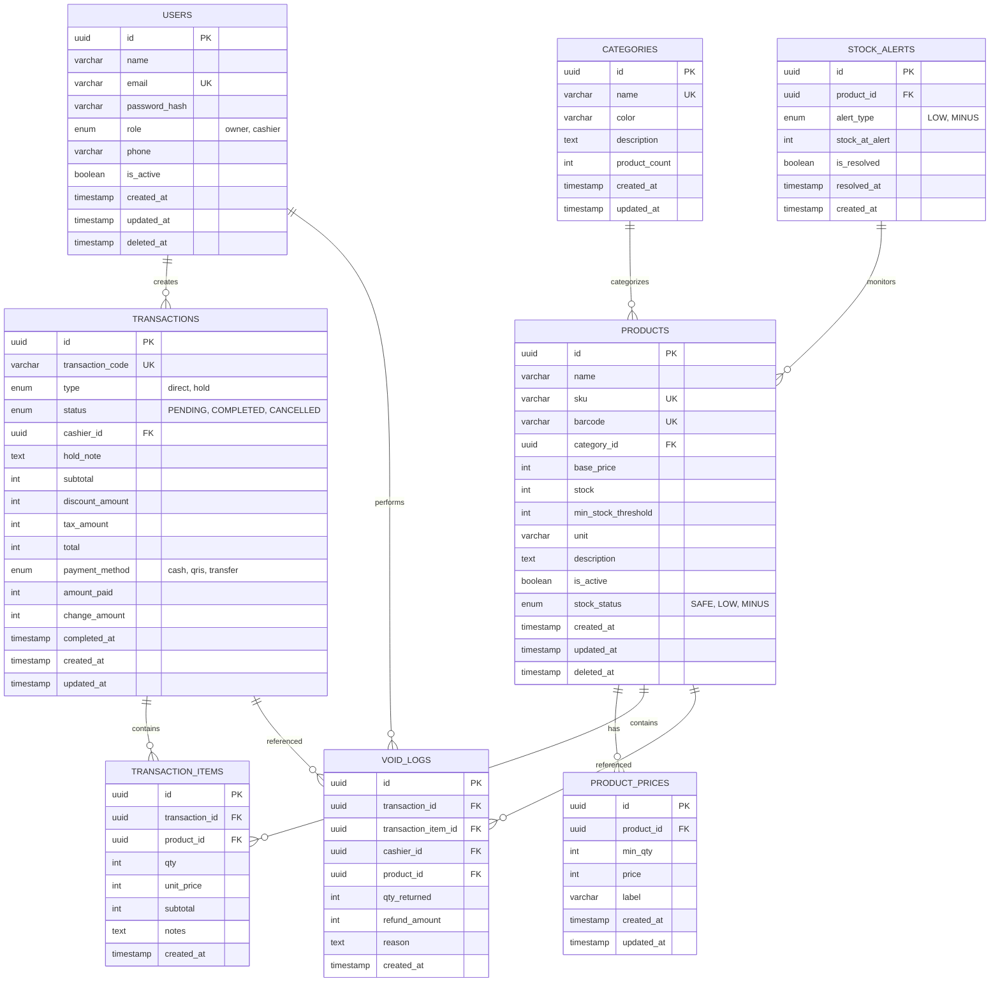

# Database Design Document (DATABASE_DESIGN) - Smart Cost V1

**Versi:** 1.0  
**Status:** Draft Disetujui  
**DBMS:** PostgreSQL 15  
**ORM:** GORM v2 (Go) / Raw SQL dengan `pgx`

---

## 1. Entity Relationship Diagram (ERD)



---

## 2. Data Dictionary Matrix

### 2.1 Table: `users`

| Column Name     | Data Type                | Constraints                   | Description           |
| :-------------- | :----------------------- | :---------------------------- | :-------------------- |
| `id`            | UUID                     | PK, DEFAULT gen_random_uuid() | Primary key user      |
| `name`          | VARCHAR(100)             | NOT NULL                      | Nama lengkap user     |
| `email`         | VARCHAR(150)             | NOT NULL, UNIQUE              | Email login           |
| `password_hash` | VARCHAR(255)             | NOT NULL                      | Hash bcrypt password  |
| `role`          | ENUM('owner', 'cashier') | NOT NULL, DEFAULT 'cashier'   | Peran akses           |
| `phone`         | VARCHAR(20)              | NULL                          | Nomor telepon         |
| `is_active`     | BOOLEAN                  | NOT NULL, DEFAULT true        | Status aktif          |
| `created_at`    | TIMESTAMP                | NOT NULL, DEFAULT NOW()       | Waktu registrasi      |
| `updated_at`    | TIMESTAMP                | NOT NULL, DEFAULT NOW()       | Waktu update terakhir |
| `deleted_at`    | TIMESTAMP                | NULL                          | Soft delete (GORM)    |

### 2.2 Table: `categories`

| Column Name     | Data Type   | Constraints                   | Description                  |
| :-------------- | :---------- | :---------------------------- | :--------------------------- |
| `id`            | UUID        | PK, DEFAULT gen_random_uuid() | Primary key kategori         |
| `name`          | VARCHAR(50) | NOT NULL, UNIQUE              | Nama kategori                |
| `color`         | VARCHAR(7)  | NOT NULL, DEFAULT '#6B7280'   | Kode warna HEX               |
| `description`   | TEXT        | NULL                          | Deskripsi kategori           |
| `product_count` | INTEGER     | NOT NULL, DEFAULT 0           | Jumlah produk (denormalized) |
| `created_at`    | TIMESTAMP   | NOT NULL, DEFAULT NOW()       | Waktu pembuatan              |
| `updated_at`    | TIMESTAMP   | NOT NULL, DEFAULT NOW()       | Waktu update                 |

### 2.3 Table: `products`

| Column Name           | Data Type                    | Constraints                             | Description             |
| :-------------------- | :--------------------------- | :-------------------------------------- | :---------------------- |
| `id`                  | UUID                         | PK, DEFAULT gen_random_uuid()           | Primary key produk      |
| `name`                | VARCHAR(150)                 | NOT NULL                                | Nama produk             |
| `sku`                 | VARCHAR(50)                  | NOT NULL, UNIQUE                        | Stock Keeping Unit      |
| `barcode`             | VARCHAR(50)                  | UNIQUE, NULL                            | Kode barcode            |
| `category_id`         | UUID                         | FK -> categories.id, ON DELETE SET NULL | Kategori produk         |
| `base_price`          | INTEGER                      | NOT NULL, DEFAULT 0                     | Harga dasar (rupiah)    |
| `stock`               | INTEGER                      | NOT NULL, DEFAULT 0                     | Stok aktual             |
| `min_stock_threshold` | INTEGER                      | NOT NULL, DEFAULT 0                     | Batas minimal stok      |
| `unit`                | VARCHAR(20)                  | NOT NULL, DEFAULT 'pcs'                 | Satuan (pcs, kg, liter) |
| `description`         | TEXT                         | NULL                                    | Deskripsi produk        |
| `is_active`           | BOOLEAN                      | NOT NULL, DEFAULT true                  | Status aktif            |
| `stock_status`        | ENUM('SAFE', 'LOW', 'MINUS') | NOT NULL, DEFAULT 'SAFE'                | Status stok (computed)  |
| `created_at`          | TIMESTAMP                    | NOT NULL, DEFAULT NOW()                 | Waktu pembuatan         |
| `updated_at`          | TIMESTAMP                    | NOT NULL, DEFAULT NOW()                 | Waktu update            |
| `deleted_at`          | TIMESTAMP                    | NULL                                    | Soft delete             |

### 2.4 Table: `product_prices`

| Column Name  | Data Type   | Constraints                          | Description                       |
| :----------- | :---------- | :----------------------------------- | :-------------------------------- |
| `id`         | UUID        | PK, DEFAULT gen_random_uuid()        | Primary key tier                  |
| `product_id` | UUID        | FK -> products.id, ON DELETE CASCADE | Produk terkait                    |
| `min_qty`    | INTEGER     | NOT NULL, CHECK (min_qty > 1)        | Minimal kuantitas                 |
| `price`      | INTEGER     | NOT NULL, CHECK (price > 0)          | Harga tier (rupiah)               |
| `label`      | VARCHAR(50) | NOT NULL                             | Label tier (e.g., "Grosir 10pcs") |
| `created_at` | TIMESTAMP   | NOT NULL, DEFAULT NOW()              | Waktu pembuatan                   |
| `updated_at` | TIMESTAMP   | NOT NULL, DEFAULT NOW()              | Waktu update                      |

### 2.5 Table: `transactions`

| Column Name        | Data Type                                 | Constraints                   | Description                   |
| :----------------- | :---------------------------------------- | :---------------------------- | :---------------------------- |
| `id`               | UUID                                      | PK, DEFAULT gen_random_uuid() | Primary key transaksi         |
| `transaction_code` | VARCHAR(20)                               | NOT NULL, UNIQUE              | Kode unik (TRX-YYMMDD-XXXX)   |
| `type`             | ENUM('direct', 'hold')                    | NOT NULL                      | Tipe transaksi                |
| `status`           | ENUM('PENDING', 'COMPLETED', 'CANCELLED') | NOT NULL, DEFAULT 'PENDING'   | Status transaksi              |
| `cashier_id`       | UUID                                      | FK -> users.id, NOT NULL      | Kasir yang membuat            |
| `hold_note`        | VARCHAR(100)                              | NULL                          | Catatan hold bill             |
| `subtotal`         | INTEGER                                   | NOT NULL, DEFAULT 0           | Subtotal sebelum diskon/pajak |
| `discount_amount`  | INTEGER                                   | NOT NULL, DEFAULT 0           | Total diskon                  |
| `tax_amount`       | INTEGER                                   | NOT NULL, DEFAULT 0           | Total pajak                   |
| `total`            | INTEGER                                   | NOT NULL, DEFAULT 0           | Total akhir                   |
| `payment_method`   | ENUM('cash', 'qris', 'transfer')          | NULL                          | Metode pembayaran             |
| `amount_paid`      | INTEGER                                   | NULL                          | Jumlah dibayar                |
| `change_amount`    | INTEGER                                   | NULL                          | Kembalian                     |
| `completed_at`     | TIMESTAMP                                 | NULL                          | Waktu penyelesaian            |
| `created_at`       | TIMESTAMP                                 | NOT NULL, DEFAULT NOW()       | Waktu pembuatan               |
| `updated_at`       | TIMESTAMP                                 | NOT NULL, DEFAULT NOW()       | Waktu update                  |

### 2.6 Table: `transaction_items`

| Column Name      | Data Type | Constraints                              | Description                 |
| :--------------- | :-------- | :--------------------------------------- | :-------------------------- |
| `id`             | UUID      | PK, DEFAULT gen_random_uuid()            | Primary key item            |
| `transaction_id` | UUID      | FK -> transactions.id, ON DELETE CASCADE | Transaksi terkait           |
| `product_id`     | UUID      | FK -> products.id, ON DELETE RESTRICT    | Produk terkait              |
| `qty`            | INTEGER   | NOT NULL, CHECK (qty > 0)                | Kuantitas                   |
| `unit_price`     | INTEGER   | NOT NULL                                 | Harga satuan saat transaksi |
| `subtotal`       | INTEGER   | NOT NULL                                 | Subtotal item               |
| `notes`          | TEXT      | NULL                                     | Catatan item                |
| `created_at`     | TIMESTAMP | NOT NULL, DEFAULT NOW()                  | Waktu pembuatan             |

### 2.7 Table: `void_logs`

| Column Name           | Data Type | Constraints                                   | Description          |
| :-------------------- | :-------- | :-------------------------------------------- | :------------------- |
| `id`                  | UUID      | PK, DEFAULT gen_random_uuid()                 | Primary key log      |
| `transaction_id`      | UUID      | FK -> transactions.id, ON DELETE CASCADE      | Transaksi terkait    |
| `transaction_item_id` | UUID      | FK -> transaction_items.id, ON DELETE CASCADE | Item terkait         |
| `cashier_id`          | UUID      | FK -> users.id, NOT NULL                      | Kasir yang melakukan |
| `product_id`          | UUID      | FK -> products.id, ON DELETE RESTRICT         | Produk terkait       |
| `qty_returned`        | INTEGER   | NOT NULL, CHECK (qty_returned > 0)            | Jumlah dikembalikan  |
| `refund_amount`       | INTEGER   | NOT NULL                                      | Nominal refund       |
| `reason`              | TEXT      | NOT NULL                                      | Alasan return        |
| `created_at`          | TIMESTAMP | NOT NULL, DEFAULT NOW()                       | Waktu return         |

### 2.8 Table: `stock_alerts`

| Column Name      | Data Type            | Constraints                          | Description            |
| :--------------- | :------------------- | :----------------------------------- | :--------------------- |
| `id`             | UUID                 | PK, DEFAULT gen_random_uuid()        | Primary key alert      |
| `product_id`     | UUID                 | FK -> products.id, ON DELETE CASCADE | Produk terkait         |
| `alert_type`     | ENUM('LOW', 'MINUS') | NOT NULL                             | Tipe alert             |
| `stock_at_alert` | INTEGER              | NOT NULL                             | Stok saat alert dibuat |
| `is_resolved`    | BOOLEAN              | NOT NULL, DEFAULT false              | Status resolved        |
| `resolved_at`    | TIMESTAMP            | NULL                                 | Waktu resolve          |
| `created_at`     | TIMESTAMP            | NOT NULL, DEFAULT NOW()              | Waktu alert            |

---

## 3. Performance Optimization Plan

### 3.1 Indexing Strategy

| Table               | Index Name                  | Columns                    | Type           | Purpose                 |
| :------------------ | :-------------------------- | :------------------------- | :------------- | :---------------------- |
| `users`             | `idx_users_email`           | `email`                    | B-Tree, UNIQUE | Fast login lookup       |
| `users`             | `idx_users_role`            | `role`                     | B-Tree         | Filter owner/cashier    |
| `products`          | `idx_products_sku`          | `sku`                      | B-Tree, UNIQUE | SKU uniqueness          |
| `products`          | `idx_products_barcode`      | `barcode`                  | B-Tree, UNIQUE | Barcode scan            |
| `products`          | `idx_products_category`     | `category_id`              | B-Tree         | Category filter         |
| `products`          | `idx_products_stock_status` | `stock_status`             | B-Tree         | Dashboard alerts        |
| `products`          | `idx_products_search`       | `name`, `sku`, `barcode`   | GIN (pg_trgm)  | Fuzzy search kasir      |
| `product_prices`    | `idx_prices_product_qty`    | `product_id`, `min_qty`    | B-Tree         | Price tier lookup       |
| `transactions`      | `idx_txn_code`              | `transaction_code`         | B-Tree, UNIQUE | Code lookup             |
| `transactions`      | `idx_txn_cashier`           | `cashier_id`               | B-Tree         | Cashier performance     |
| `transactions`      | `idx_txn_status`            | `status`                   | B-Tree         | Hold bill filter        |
| `transactions`      | `idx_txn_created`           | `created_at`               | B-Tree         | Date range reports      |
| `transactions`      | `idx_txn_date_cashier`      | `created_at`, `cashier_id` | B-Tree         | Composite report filter |
| `transaction_items` | `idx_items_transaction`     | `transaction_id`           | B-Tree         | Transaction detail      |
| `transaction_items` | `idx_items_product`         | `product_id`               | B-Tree         | Product sales stats     |
| `void_logs`         | `idx_void_cashier`          | `cashier_id`               | B-Tree         | Audit filter            |
| `void_logs`         | `idx_void_created`          | `created_at`               | B-Tree         | Date range audit        |
| `stock_alerts`      | `idx_alert_resolved`        | `is_resolved`              | B-Tree         | Unresolved alerts       |

### 3.2 Optimization Policies

1. **Computed Column `stock_status`:** Kolom `stock_status` di tabel `products` di-update via database trigger setiap kali `stock` berubah, menghindari perhitungan runtime:

   ```sql
   CREATE OR REPLACE FUNCTION update_stock_status()
   RETURNS TRIGGER AS $$
   BEGIN
       IF NEW.stock < 0 THEN
           NEW.stock_status := 'MINUS';
       ELSIF NEW.stock <= NEW.min_stock_threshold THEN
           NEW.stock_status := 'LOW';
       ELSE
           NEW.stock_status := 'SAFE';
       END IF;
       RETURN NEW;
   END;
   $$ LANGUAGE plpgsql;
   ```

2. **Transaction Isolation:** Semua operasi pemotongan stok menggunakan `SERIALIZABLE` isolation level untuk mencegah race condition:

   ```sql
   BEGIN TRANSACTION ISOLATION LEVEL SERIALIZABLE;
   SELECT stock FROM products WHERE id = ? FOR UPDATE;
   UPDATE products SET stock = stock - ? WHERE id = ?;
   COMMIT;
   ```

3. **Connection Pooling:** `pgx` pool dengan max 25 connections, min 5 connections, max conn lifetime 1 jam.

4. **Read Replicas:** Untuk reporting (`/reports/*`), query diarahkan ke read replica PostgreSQL untuk mengurangi beban primary.

---

## 4. Data Seeding Specifications

### 4.1 Seed Script Structure

```go
// cmd/seed/main.go
package main

func main() {
    // 1. Seed Owner Account
    owner := User{
        Name:     "Andi Wijaya",
        Email:    "andi@warungku.com",
        Password: bcryptHash("owner12345"),
        Role:     "owner",
        IsActive: true,
    }

    // 2. Seed Categories
    categories := []Category{
        {Name: "Makanan", Color: "#FF6B6B"},
        {Name: "Minuman", Color: "#4ECDC4"},
        {Name: "Snack", Color: "#FFE66D"},
        {Name: "Rokok", Color: "#95E1D3"},
    }

    // 3. Seed Products (UMKM Template - FR-09)
    products := []Product{
        {
            Name: "Es Teh Manis", SKU: "ETM-001", Barcode: "8991234567001",
            BasePrice: 4000, Stock: 50, MinStockThreshold: 10, Unit: "pcs",
            CategoryID: catMinuman, IsActive: true,
        },
        {
            Name: "Teh Kotak 250ml", SKU: "TK-001", Barcode: "8991234567002",
            BasePrice: 3000, Stock: 100, MinStockThreshold: 20, Unit: "pcs",
            CategoryID: catMinuman, IsActive: true,
            PriceTiers: []ProductPrice{
                {MinQty: 10, Price: 2500, Label: "Grosir 10pcs"},
                {MinQty: 50, Price: 2200, Label: "Grosir 50pcs"},
            },
        },
        {
            Name: "Nasi Goreng Ayam", SKU: "NGA-001", Barcode: "8991234567003",
            BasePrice: 30000, Stock: 20, MinStockThreshold: 5, Unit: "porsi",
            CategoryID: catMakanan, IsActive: true,
        },
        {
            Name: "Air Mineral 600ml", SKU: "AM-001", Barcode: "8991234567004",
            BasePrice: 3500, Stock: 80, MinStockThreshold: 15, Unit: "pcs",
            CategoryID: catMinuman, IsActive: true,
        },
        {
            Name: "Gudang Garam", SKU: "GG-001", Barcode: "8991234567005",
            BasePrice: 25000, Stock: 30, MinStockThreshold: 5, Unit: "bungkus",
            CategoryID: catRokok, IsActive: true,
        },
    }

    // 4. Seed Cashier Account
    cashier := User{
        Name:     "Siti Aminah",
        Email:    "siti@warungku.com",
        Password: bcryptHash("kasir12345"),
        Role:     "cashier",
        IsActive: true,
    }
}
```

### 4.2 Mock Transaction Data (Development Only)

```go
// Generate 100 mock transactions for dashboard testing
for i := 0; i < 100; i++ {
    tx := Transaction{
        TransactionCode: fmt.Sprintf("TRX-%06d", i+1),
        Type:           "direct",
        Status:         "COMPLETED",
        CashierID:      cashier.ID,
        Subtotal:       rand.Intn(50000) + 10000,
        Total:          0, // calculated
        PaymentMethod:  "cash",
        AmountPaid:     0, // calculated
        ChangeAmount:   0, // calculated
        CreatedAt:      time.Now().AddDate(0, 0, -rand.Intn(30)),
    }
    tx.Total = tx.Subtotal
    tx.AmountPaid = tx.Total + rand.Intn(10000)
    tx.ChangeAmount = tx.AmountPaid - tx.Total
}
```
