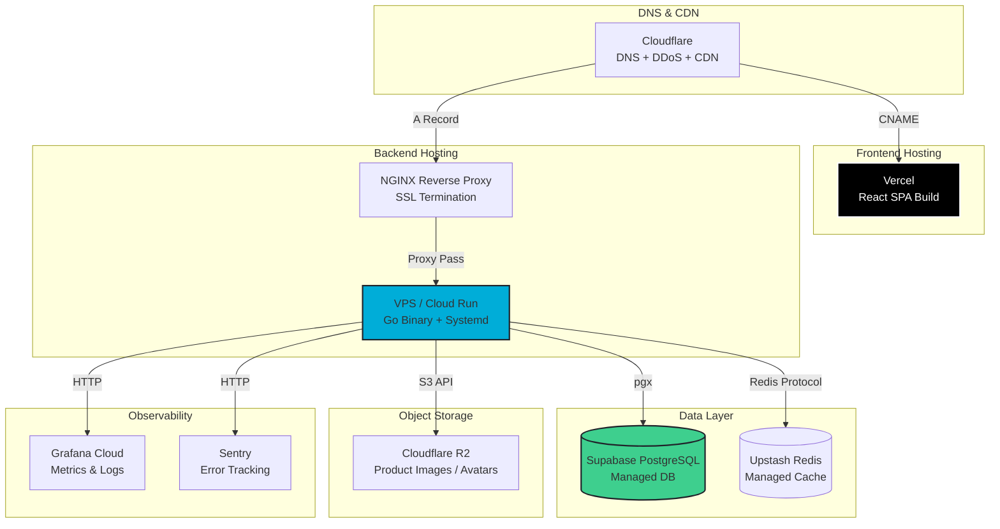
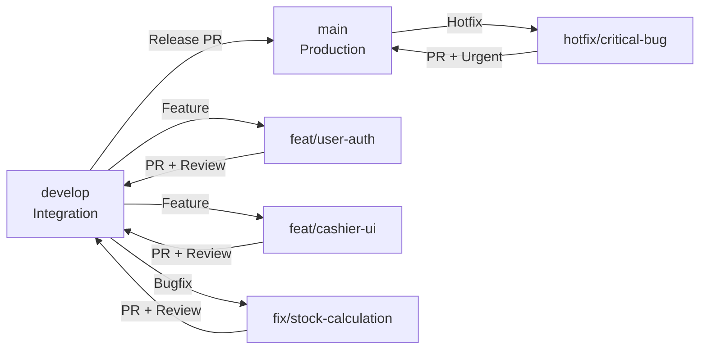

# Deployment Guide (DEPLOYMENT) - Smart Cost V1

**Versi:** 1.0  
**Status:** Draft Disetujui  
**Last Updated:** 2024-06-20

---

## 1. Target Infrastructure Map



### 1.1 Infrastructure Components

| Service               | Provider               | Tier                        | Purpose                                            |
| :-------------------- | :--------------------- | :-------------------------- | :------------------------------------------------- |
| **Frontend Hosting**  | Vercel                 | Pro ($20/mo)                | React SPA deployment dengan edge network global    |
| **Backend Hosting**   | DigitalOcean / Hetzner | 2 vCPU, 4GB RAM ($12-24/mo) | Go binary + systemd service                        |
| **Reverse Proxy**     | NGINX                  | Self-hosted                 | SSL termination, rate limiting, static compression |
| **Database**          | Supabase / AWS RDS     | Free tier / db.t3.micro     | PostgreSQL 15 managed                              |
| **Cache**             | Upstash Redis          | Free tier (10K ops/day)     | Session cache, rate limiting                       |
| **Object Storage**    | Cloudflare R2          | Free tier (10GB)            | Product images, user avatars                       |
| **Error Tracking**    | Sentry                 | Developer (5K errors/mo)    | Real-time error monitoring                         |
| **Uptime Monitoring** | UptimeRobot            | Free tier                   | HTTP endpoint monitoring                           |

---

## 2. CI/CD Pipeline Automation Rules

### 2.1 Git Branch Strategy



### 2.2 GitHub Actions Workflow

#### Backend CI/CD (`.github/workflows/backend.yml`)

```yaml
name: Backend CI/CD

on:
  push:
    branches: [main, develop]
    paths: ["backend/**"]
  pull_request:
    branches: [main, develop]
    paths: ["backend/**"]

jobs:
  test:
    runs-on: ubuntu-latest
    services:
      postgres:
        image: postgres:15-alpine
        env:
          POSTGRES_USER: test
          POSTGRES_PASSWORD: test
          POSTGRES_DB: smart_cost_test
        options: >-
          --health-cmd pg_isready
          --health-interval 10s
          --health-timeout 5s
          --health-retries 5
        ports:
          - 5432:5432

    steps:
      - uses: actions/checkout@v4
      - uses: actions/setup-go@v5
        with:
          go-version: "1.21"

      - name: Install dependencies
        run: cd backend && go mod download

      - name: Run linter
        run: cd backend && go vet ./...

      - name: Run tests
        run: cd backend && go test -v -race -coverprofile=coverage.out ./...
        env:
          DB_HOST: localhost
          DB_PORT: 5432
          DB_USER: test
          DB_PASSWORD: test
          DB_NAME: smart_cost_test

      - name: Upload coverage
        uses: codecov/codecov-action@v4
        with:
          files: ./backend/coverage.out

  deploy:
    needs: test
    if: github.ref == 'refs/heads/main'
    runs-on: ubuntu-latest
    steps:
      - uses: actions/checkout@v4

      - name: Build binary
        run: |
          cd backend
          GOOS=linux GOARCH=amd64 go build -o smart-cost-api cmd/api/main.go

      - name: Deploy to VPS
        uses: appleboy/scp-action@v0.1.7
        with:
          host: ${{ secrets.VPS_HOST }}
          username: ${{ secrets.VPS_USER }}
          key: ${{ secrets.VPS_SSH_KEY }}
          source: "backend/smart-cost-api"
          target: "/opt/smart-cost/"

      - name: Restart service
        uses: appleboy/ssh-action@v1.0.3
        with:
          host: ${{ secrets.VPS_HOST }}
          username: ${{ secrets.VPS_USER }}
          key: ${{ secrets.VPS_SSH_KEY }}
          script: |
            sudo systemctl restart smart-cost-api
            sudo systemctl status smart-cost-api --no-pager
```

#### Frontend CI/CD (`.github/workflows/frontend.yml`)

```yaml
name: Frontend CI/CD

on:
  push:
    branches: [main, develop]
    paths: ["frontend/**"]
  pull_request:
    branches: [main, develop]
    paths: ["frontend/**"]

jobs:
  build:
    runs-on: ubuntu-latest
    steps:
      - uses: actions/checkout@v4
      - uses: actions/setup-node@v4
        with:
          node-version: "18"
          cache: "npm"
          cache-dependency-path: frontend/package-lock.json

      - name: Install dependencies
        run: cd frontend && npm ci

      - name: Run linter
        run: cd frontend && npm run lint

      - name: Run type check
        run: cd frontend && npm run type-check

      - name: Run tests
        run: cd frontend && npm run test:ci

      - name: Build
        run: cd frontend && npm run build

  deploy:
    needs: build
    if: github.ref == 'refs/heads/main'
    runs-on: ubuntu-latest
    steps:
      - uses: actions/checkout@v4
      - uses: actions/setup-node@v4
        with:
          node-version: "18"
          cache: "npm"
          cache-dependency-path: frontend/package-lock.json

      - name: Install Vercel CLI
        run: npm install --global vercel@latest

      - name: Deploy to Production
        run: cd frontend && vercel --prod --token=${{ secrets.VERCEL_TOKEN }}
        env:
          VERCEL_ORG_ID: ${{ secrets.VERCEL_ORG_ID }}
          VERCEL_PROJECT_ID: ${{ secrets.VERCEL_PROJECT_ID }}
```

### 2.3 Conventional Commit Standards

```
<type>(<scope>): <subject>

<body>

<footer>
```

| Type       | Usage              | Example                                                      |
| :--------- | :----------------- | :----------------------------------------------------------- |
| `feat`     | New feature        | `feat(cashier): add hold bill functionality`                 |
| `fix`      | Bug fix            | `fix(stock): prevent race condition on concurrent deduction` |
| `docs`     | Documentation only | `docs(readme): update deployment instructions`               |
| `style`    | Formatting         | `style(ui): fix indentation in cashier page`                 |
| `refactor` | Code restructuring | `refactor(auth): extract JWT middleware`                     |
| `perf`     | Performance        | `perf(query): add index on transactions.created_at`          |
| `test`     | Tests              | `test(api): add unit tests for transaction service`          |
| `chore`    | Maintenance        | `chore(deps): update gin to v1.9.1`                          |

### 2.4 Pull Request Rules

- **Minimum 1 approval** untuk merge ke `develop`
- **Minimum 2 approvals** untuk merge ke `main`
- **Semua CI checks harus passing** (tests, lint, type-check)
- **Branch harus up-to-date** dengan target branch sebelum merge
- **Squash and merge** untuk feature branches
- **Merge commit** untuk release branches

---

## 3. Production Environment Variable Inventory

### 3.1 Backend Environment Variables

| Variable               | Description              | Example                                |
| :--------------------- | :----------------------- | :------------------------------------- |
| `APP_ENV`              | Environment mode         | `production`                           |
| `SERVER_PORT`          | HTTP server port         | `8080`                                 |
| `SERVER_HOST`          | Bind address             | `0.0.0.0`                              |
| `DB_HOST`              | PostgreSQL host          | `db.xxx.supabase.co`                   |
| `DB_PORT`              | PostgreSQL port          | `5432`                                 |
| `DB_USER`              | Database user            | `postgres`                             |
| `DB_PASSWORD`          | Database password        | `[REDACTED]`                           |
| `DB_NAME`              | Database name            | `smart_cost`                           |
| `DB_SSL_MODE`          | SSL mode                 | `require`                              |
| `DB_MAX_OPEN_CONNS`    | Max connections          | `25`                                   |
| `DB_MAX_IDLE_CONNS`    | Max idle connections     | `5`                                    |
| `REDIS_HOST`           | Redis host               | `redis-xxx.upstash.io`                 |
| `REDIS_PORT`           | Redis port               | `6379`                                 |
| `REDIS_PASSWORD`       | Redis password           | `[REDACTED]`                           |
| `JWT_PRIVATE_KEY`      | RSA private key (PEM)    | `[REDACTED]`                           |
| `JWT_PUBLIC_KEY`       | RSA public key (PEM)     | `[REDACTED]`                           |
| `JWT_EXPIRY_HOURS`     | Access token expiry      | `24`                                   |
| `JWT_REFRESH_DAYS`     | Refresh token expiry     | `7`                                    |
| `CORS_ALLOWED_ORIGINS` | Allowed frontend origins | `https://app.smartcost.app`            |
| `RATE_LIMIT_RPS`       | Rate limit per second    | `100`                                  |
| `RATE_LIMIT_BURST`     | Rate limit burst         | `150`                                  |
| `SENTRY_DSN`           | Sentry DSN               | `https://xxx@xxx.ingest.sentry.io/xxx` |
| `LOG_LEVEL`            | Logging level            | `info`                                 |
| `R2_ACCESS_KEY`        | Cloudflare R2 access key | `[REDACTED]`                           |
| `R2_SECRET_KEY`        | Cloudflare R2 secret key | `[REDACTED]`                           |
| `R2_BUCKET`            | R2 bucket name           | `smart-cost-assets`                    |
| `R2_ENDPOINT`          | R2 S3 endpoint           | `https://xxx.r2.cloudflarestorage.com` |

### 3.2 Frontend Environment Variables

| Variable                | Description         | Example                                |
| :---------------------- | :------------------ | :------------------------------------- |
| `VITE_API_BASE_URL`     | Backend API URL     | `https://api.smartcost.app/api/v1`     |
| `VITE_APP_NAME`         | App display name    | `Smart Cost`                           |
| `VITE_SENTRY_DSN`       | Sentry frontend DSN | `https://xxx@xxx.ingest.sentry.io/xxx` |
| `VITE_ENABLE_ANALYTICS` | Enable analytics    | `true`                                 |

---

## 4. Live Database Migration Procedures

### 4.1 Migration Tool: golang-migrate

```bash
# Install migrate CLI
curl -L https://github.com/golang-migrate/migrate/releases/download/v4.17.0/migrate.linux-amd64.tar.gz | tar xvz
sudo mv migrate /usr/local/bin/
```

### 4.2 Migration File Naming Convention

```
migrations/
├── 000001_create_users_table.up.sql
├── 000001_create_users_table.down.sql
├── 000002_create_products_table.up.sql
├── 000002_create_products_table.down.sql
├── 000003_add_price_tiers.up.sql
├── 000003_add_price_tiers.down.sql
└── ...
```

### 4.3 Zero-Downtime Migration Strategy

#### Phase 1: Add Column (Non-Blocking)

```sql
-- 000004_add_stock_status.up.sql
-- Step 1: Add column as nullable
ALTER TABLE products ADD COLUMN stock_status VARCHAR(10);

-- Step 2: Backfill data in batches
UPDATE products
SET stock_status = CASE
    WHEN stock < 0 THEN 'MINUS'
    WHEN stock <= min_stock_threshold THEN 'LOW'
    ELSE 'SAFE'
END
WHERE stock_status IS NULL;

-- Step 3: Add NOT NULL constraint
ALTER TABLE products ALTER COLUMN stock_status SET NOT NULL;
ALTER TABLE products ALTER COLUMN stock_status SET DEFAULT 'SAFE';
```

#### Phase 2: Add Index (Concurrently)

```sql
-- 000005_add_product_search_index.up.sql
-- Use CONCURRENTLY to avoid table lock
CREATE INDEX CONCURRENTLY idx_products_search ON products
USING gin (name gin_trgm_ops, sku gin_trgm_ops, barcode gin_trgm_ops);
```

#### Phase 3: Deployment Sequence

```bash
#!/bin/bash
# deploy-migration.sh

set -e

echo "=== Smart Cost Migration Deployment ==="

# 1. Backup database
echo "[1/5] Creating database backup..."
pg_dump $DATABASE_URL > backups/pre-migration-$(date +%Y%m%d-%H%M%S).sql

# 2. Enable maintenance mode (optional)
echo "[2/5] Enabling maintenance mode..."
curl -X POST https://api.smartcost.app/admin/maintenance   -H "Authorization: Bearer $ADMIN_TOKEN"   -d '{"enabled": true}'

# 3. Run migrations
echo "[3/5] Running database migrations..."
migrate -path ./migrations -database "$DATABASE_URL" up

# 4. Verify migrations
echo "[4/5] Verifying migration status..."
migrate -path ./migrations -database "$DATABASE_URL" version

# 5. Disable maintenance mode
echo "[5/5] Disabling maintenance mode..."
curl -X POST https://api.smartcost.app/admin/maintenance   -H "Authorization: Bearer $ADMIN_TOKEN"   -d '{"enabled": false}'

echo "=== Migration completed successfully ==="
```

### 4.4 Rollback Procedure

```bash
# Emergency rollback
echo "Rolling back last migration..."
migrate -path ./migrations -database "$DATABASE_URL" down 1

# Restore from backup (if migration corrupts data)
echo "Restoring from backup..."
psql $DATABASE_URL < backups/pre-migration-YYYYMMDD-HHMMSS.sql
```

### 4.5 Migration Checklist

- [ ] Backup database sebelum migration
- [ ] Jalankan migration di staging environment terlebih dahulu
- [ ] Gunakan `CONCURRENTLY` untuk semua `CREATE INDEX`
- [ ] Pastikan migration backward-compatible (aplikasi lama tetap jalan)
- [ ] Monitor error rate selama 30 menit post-deployment
- [ ] Siapkan rollback plan
