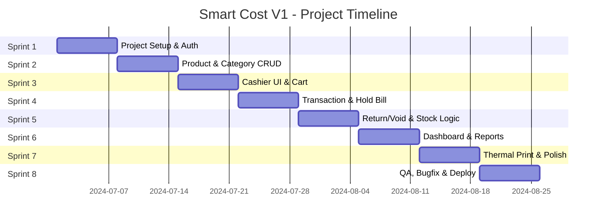

# Project Plan (PROJECT_PLAN) - Smart Cost V1

**Versi:** 1.0  
**Status:** Draft Disetujui  
**Timeline:** 8 Weeks (Sprint-based)  
**Team Size:** 4 Developers (1 Lead, 2 Fullstack, 1 QA)

---

## 1. Work Breakdown Structure (WBS) & Milestones

### Milestone Overview



### Detailed WBS

#### Sprint 1: Foundation & Authentication (Week 1)

**Target: 2024-07-01 -> 2024-07-07**

| ID  | Task                                                | Assignee | Est. Hours | Dependencies |
| :-- | :-------------------------------------------------- | :------- | :--------- | :----------- |
| 1.1 | Initialize Go project structure (Gin, GORM, config) | Lead     | 8h         | -            |
| 1.2 | Initialize React project (Vite, Tailwind, Router)   | FS1      | 6h         | -            |
| 1.3 | Design database schema & create migrations          | Lead     | 6h         | 1.1          |
| 1.4 | Implement JWT authentication (login/logout/refresh) | Lead     | 8h         | 1.1, 1.3     |
| 1.5 | Implement user registration (owner creates cashier) | Lead     | 6h         | 1.4          |
| 1.6 | Build login page UI (responsive)                    | FS1      | 6h         | 1.2          |
| 1.7 | Integrate auth API with frontend                    | FS1      | 4h         | 1.4, 1.6     |
| 1.8 | Setup CI/CD pipeline (GitHub Actions)               | Lead     | 4h         | -            |
| 1.9 | Sprint 1 Review & Retrospective                     | Team     | 2h         | All          |

**Deliverable:** Login system functional, project scaffolding complete.

---

#### Sprint 2: Product & Category Management (Week 2)

**Target: 2024-07-08 -> 2024-07-14**

| ID  | Task                                              | Assignee | Est. Hours | Dependencies |
| :-- | :------------------------------------------------ | :------- | :--------- | :----------- |
| 2.1 | Implement category CRUD API                       | FS2      | 6h         | 1.3          |
| 2.2 | Implement product CRUD API with price tiers       | FS2      | 10h        | 2.1          |
| 2.3 | Implement barcode scanning integration            | FS2      | 4h         | 2.2          |
| 2.4 | Build product list page (owner)                   | FS1      | 8h         | 1.6          |
| 2.5 | Build product form (create/edit with price tiers) | FS1      | 10h        | 2.4          |
| 2.6 | Build category management UI                      | FS1      | 4h         | 2.4          |
| 2.7 | Implement product search & filter                 | FS2      | 4h         | 2.2          |
| 2.8 | Write unit tests for product service              | FS2      | 4h         | 2.2          |
| 2.9 | Sprint 2 Review & Retrospective                   | Team     | 2h         | All          |

**Deliverable:** Owner dapat CRUD produk dan kategori dengan multi-harga.

---

#### Sprint 3: Cashier Interface (Week 3)

**Target: 2024-07-15 -> 2024-07-21**

| ID  | Task                                                 | Assignee | Est. Hours | Dependencies |
| :-- | :--------------------------------------------------- | :------- | :--------- | :----------- |
| 3.1 | Implement product search API (optimized for cashier) | FS2      | 6h         | 2.2          |
| 3.2 | Build cashier page layout (mobile-first)             | FS1      | 10h        | 1.6          |
| 3.3 | Implement product grid with category filter          | FS1      | 8h         | 3.2          |
| 3.4 | Implement shopping cart state (Zustand)              | FS1      | 6h         | 3.3          |
| 3.5 | Implement real-time price calculation (grosir)       | FS1      | 6h         | 3.4          |
| 3.6 | Implement stock indicator (SAFE/LOW/MINUS)           | FS1      | 4h         | 3.3          |
| 3.7 | Add barcode scanner input support                    | FS1      | 4h         | 3.3          |
| 3.8 | Write integration tests for cashier flow             | QA       | 6h         | 3.5          |
| 3.9 | Sprint 3 Review & Retrospective                      | Team     | 2h         | All          |

**Deliverable:** Kasir dapat mencari produk, menambah ke keranjang, melihat harga grosir otomatis.

---

#### Sprint 4: Transaction & Hold Bill (Week 4)

**Target: 2024-07-22 -> 2024-07-28**

| ID  | Task                                                 | Assignee | Est. Hours | Dependencies |
| :-- | :--------------------------------------------------- | :------- | :--------- | :----------- |
| 4.1 | Implement transaction creation API (direct pay)      | Lead     | 8h         | 1.3          |
| 4.2 | Implement hold bill API (status PENDING)             | Lead     | 6h         | 4.1          |
| 4.3 | Implement stock deduction with concurrency lock      | Lead     | 8h         | 4.1          |
| 4.4 | Build payment modal (cash input, change calculation) | FS1      | 6h         | 3.5          |
| 4.5 | Build hold bill panel & recall functionality         | FS1      | 8h         | 3.5          |
| 4.6 | Implement transaction history (shift view)           | FS1      | 6h         | 4.5          |
| 4.7 | Add transaction code generation (TRX-YYMMDD-XXXX)    | Lead     | 2h         | 4.1          |
| 4.8 | Write load tests for concurrent transactions         | QA       | 6h         | 4.3          |
| 4.9 | Sprint 4 Review & Retrospective                      | Team     | 2h         | All          |

**Deliverable:** Kasir dapat checkout langsung dan hold bill dengan stok terkunci.

---

#### Sprint 5: Return/Void & Stock Alerts (Week 5)

**Target: 2024-07-29 -> 2024-08-04**

| ID  | Task                                             | Assignee | Est. Hours | Dependencies |
| :-- | :----------------------------------------------- | :------- | :--------- | :----------- |
| 5.1 | Implement return/void API with stock restoration | FS2      | 8h         | 4.1          |
| 5.2 | Implement void_logs audit table                  | FS2      | 4h         | 5.1          |
| 5.3 | Build return item UI (from transaction history)  | FS1      | 8h         | 4.6          |
| 5.4 | Implement stock alert trigger (LOW/MINUS)        | FS2      | 6h         | 4.3          |
| 5.5 | Build stock alert notification component         | FS1      | 6h         | 5.4          |
| 5.6 | Implement stock adjustment API (owner)           | FS2      | 4h         | 5.4          |
| 5.7 | Build stock adjustment UI                        | FS1      | 4h         | 5.6          |
| 5.8 | Write audit trail tests                          | QA       | 6h         | 5.1          |
| 5.9 | Sprint 5 Review & Retrospective                  | Team     | 2h         | All          |

**Deliverable:** Return/void functional, stock alerts visible to owner.

---

#### Sprint 6: Dashboard & Reports (Week 6)

**Target: 2024-08-05 -> 2024-08-11**

| ID   | Task                                              | Assignee | Est. Hours | Dependencies |
| :--- | :------------------------------------------------ | :------- | :--------- | :----------- |
| 6.1  | Implement sales aggregation API (daily/monthly)   | FS2      | 8h         | 4.1          |
| 6.2  | Implement cashier performance API                 | FS2      | 6h         | 6.1          |
| 6.3  | Implement stock alerts report API                 | FS2      | 4h         | 5.4          |
| 6.4  | Build owner dashboard layout                      | FS1      | 8h         | 1.6          |
| 6.5  | Build revenue chart component (Recharts/Chart.js) | FS1      | 8h         | 6.4          |
| 6.6  | Build cashier performance table                   | FS1      | 6h         | 6.4          |
| 6.7  | Build stock alerts dashboard panel                | FS1      | 6h         | 6.4          |
| 6.8  | Implement date range filter for reports           | FS1      | 4h         | 6.5          |
| 6.9  | Write report API tests                            | QA       | 6h         | 6.1          |
| 6.10 | Sprint 6 Review & Retrospective                   | Team     | 2h         | All          |

**Deliverable:** Owner dapat melihat dashboard dengan grafik dan performa kasir.

---

#### Sprint 7: Thermal Print & Polish (Week 7)

**Target: 2024-08-12 -> 2024-08-18**

| ID   | Task                                            | Assignee | Est. Hours | Dependencies |
| :--- | :---------------------------------------------- | :------- | :--------- | :----------- |
| 7.1  | Research Web Bluetooth API for thermal printers | FS2      | 4h         | -            |
| 7.2  | Implement print receipt service                 | FS2      | 8h         | 7.1          |
| 7.3  | Build print receipt UI (preview + print button) | FS1      | 6h         | 7.2          |
| 7.4  | Implement UMKM template data seeding (FR-09)    | FS2      | 4h         | 2.2          |
| 7.5  | Add loading states & skeleton screens           | FS1      | 6h         | All          |
| 7.6  | Implement error boundaries (React)              | FS1      | 4h         | All          |
| 7.7  | Add toast notifications (success/error)         | FS1      | 4h         | All          |
| 7.8  | Performance optimization (lazy loading, memo)   | FS1      | 6h         | All          |
| 7.9  | Cross-browser testing                           | QA       | 8h         | All          |
| 7.10 | Sprint 7 Review & Retrospective                 | Team     | 2h         | All          |

**Deliverable:** Thermal print functional, UI polish complete.

---

#### Sprint 8: QA, Bugfix & Deployment (Week 8)

**Target: 2024-08-19 -> 2024-08-25**

| ID   | Task                                            | Assignee | Est. Hours | Dependencies |
| :--- | :---------------------------------------------- | :------- | :--------- | :----------- |
| 8.1  | Execute full QA checklist (see QA_CHECKLIST.md) | QA       | 16h        | All          |
| 8.2  | Bug triage & prioritization                     | Lead     | 4h         | 8.1          |
| 8.3  | Critical bug fixes                              | All      | 16h        | 8.2          |
| 8.4  | Security audit (OWASP Top 10)                   | Lead     | 8h         | All          |
| 8.5  | Performance audit (Lighthouse > 90)             | FS1      | 6h         | All          |
| 8.6  | Production environment setup                    | Lead     | 8h         | -            |
| 8.7  | Database migration to production                | Lead     | 4h         | 8.6          |
| 8.8  | Deploy to production (Vercel + VPS)             | Lead     | 4h         | 8.7          |
| 8.9  | Smoke test production                           | QA       | 4h         | 8.8          |
| 8.10 | Post-mortem & project closure                   | Team     | 2h         | All          |

**Deliverable:** Smart Cost V1 live in production.

---

## 2. Git Governance & Workflow Standards

### 2.1 Branch Naming Convention

| Prefix      | Usage                   | Example                        |
| :---------- | :---------------------- | :----------------------------- |
| `feat/`     | New feature             | `feat/cashier-hold-bill`       |
| `fix/`      | Bug fix                 | `fix/stock-race-condition`     |
| `hotfix/`   | Critical production fix | `hotfix/auth-token-leak`       |
| `docs/`     | Documentation update    | `docs/api-endpoints`           |
| `refactor/` | Code restructuring      | `refactor/transaction-service` |
| `chore/`    | Maintenance tasks       | `chore/update-dependencies`    |
| `test/`     | Test additions          | `test/cashier-integration`     |

### 2.2 Commit Message Template

```
<type>(<scope>): <subject> (#<ticket-id>)

<body: explain WHAT and WHY, not HOW>

<footer: BREAKING CHANGE, Closes #123, Co-authored-by>
```

### 2.3 Pull Request Template

```markdown
## Description

<!-- Jelaskan perubahan yang dilakukan -->

## Type of Change

- [ ] Bug fix
- [ ] New feature
- [ ] Breaking change
- [ ] Documentation

## Testing

<!-- Jelaskan testing yang dilakukan -->

- [ ] Unit tests passing
- [ ] Integration tests passing
- [ ] Manual testing completed

## Checklist

- [ ] Code follows style guide
- [ ] Self-review completed
- [ ] Comments added for complex logic
- [ ] Documentation updated
- [ ] No console.log statements
```

### 2.4 Merge Requirements

| Branch     | Required Approvals | CI Passing | Up-to-date |
| :--------- | :----------------- | :--------- | :--------- |
| `develop`  | 1                  | ✅         | ✅         |
| `main`     | 2                  | ✅         | ✅         |
| `hotfix/*` | 1 (urgent)         | ✅         | N/A        |

---

## 3. Risk Management & Contingency Matrix

| Risk ID | Risk Description                                     | Probability | Impact   | Mitigation Strategy                                  | Contingency Plan                                                           |
| :------ | :--------------------------------------------------- | :---------- | :------- | :--------------------------------------------------- | :------------------------------------------------------------------------- |
| R-01    | Race condition pada pengurangan stok konkuren        | Medium      | High     | Gunakan `SELECT FOR UPDATE` + serializable isolation | Implement optimistic locking dengan retry mechanism                        |
| R-02    | Thermal printer tidak kompatibel dengan semua device | High        | Medium   | Dukung Web Bluetooth & Web USB API                   | Fallback ke PDF download/email receipt                                     |
| R-03    | Koneksi internet tidak stabil di lokasi UMKM         | High        | High     | Implement retry logic dengan exponential backoff     | Tidak mendukung offline (Won't-Have FR-10), berikan pesan error yang jelas |
| R-04    | Scope creep pada fitur laporan                       | Medium      | Medium   | Batasi report ke daily/monthly saja MVP              | Defer fitur custom report ke V2                                            |
| R-05    | Performa query lambat saat data transaksi besar      | Low         | High     | Indexing strategis, pagination, read replica         | Implement materialized view untuk report harian                            |
| R-06    | Kehilangan data transaksi                            | Low         | Critical | Automated backup harian, transaction logging         | Restore dari backup terakhir, rekonstitusi data dari void_logs             |
| R-07    | Team member sakit/absen                              | Medium      | Medium   | Cross-training antar developer                       | Redistribute task ke developer lain, extend sprint jika perlu              |
| R-08    | Third-party service downtime (Supabase/Upstash)      | Low         | High     | Health check endpoint, circuit breaker pattern       | Fallback ke in-memory cache sementara, queue write operations              |
