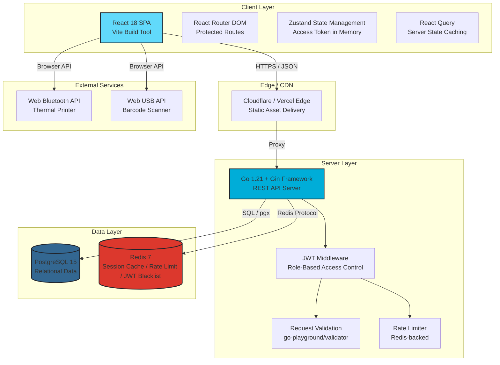
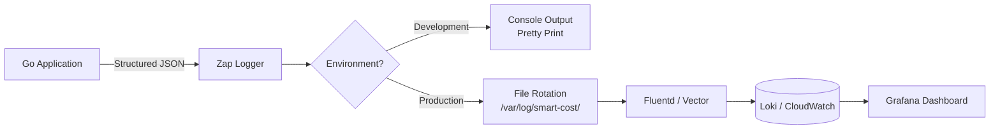
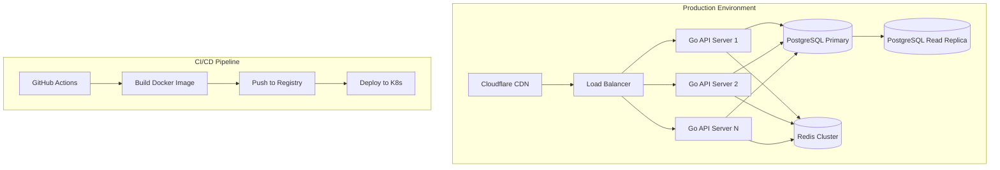

# Technical Specification Document (TECH_SPEC) - Smart Cost V1

**Versi:** 1.1  
**Status:** Regenerated & Synced with PRD + SERVICES  
**Target Rilis:** MVP

---

## 1. System Architecture Diagram



### Architecture Rationale

- **SPA (Single Page Application):** Halaman kasir memerlukan interaktivitas tinggi (scan barcode, hold bill, perhitungan real-time). React SPA dengan Vite memberikan cold start < 1 detik dan HMR untuk development cepat.
- **Go + Gin:** Gin menawarkan routing performa tinggi dengan overhead minimal (~40x lebih cepat dari framework PHP tradisional). Goroutine-native concurrency menangani multiple kasir yang mengakses stok secara bersamaan tanpa blocking.
- **PostgreSQL:** ACID compliance dan row-level locking (`SELECT FOR UPDATE`) kritis untuk mencegah race condition saat pemotongan stok konkuren.
- **Redis:** Digunakan untuk JWT blacklist (revocation), session caching, dan rate limiting pada endpoint login.

---

## 2. Tech Stack Rationale

| Layer                  | Technology                 | Alternatives Considered         | Decision Rationale                                                                                                            |
| :--------------------- | :------------------------- | :------------------------------ | :---------------------------------------------------------------------------------------------------------------------------- |
| **Frontend Framework** | React 18 + Vite            | Vue 3, Svelte                   | Ekosistem terbesar untuk POS UI libraries; Vite memberikan build time 10x lebih cepat dari CRA.                               |
| **State Management**   | Zustand + React Query      | Redux Toolkit, MobX             | Zustand minimalis tanpa boilerplate; React Query menangani caching server state (stok, produk) secara otomatis.               |
| **UI Component**       | Tailwind CSS + Headless UI | Material UI, Chakra UI          | Tailwind memberikan kontrol penuh atas responsif mobile; Headless UI menyediakan accessible primitives tanpa styling lock-in. |
| **Backend Framework**  | Go 1.21 + Gin              | Node.js/Express, Python/FastAPI | Compile-time type safety, goroutine concurrency untuk stok locking, binary deployment tunggal tanpa runtime dependency.       |
| **Database**           | PostgreSQL 15              | MySQL 8, MongoDB                | Row-level locking (`FOR UPDATE`), JSONB untuk fleksibel price tiers, mature Go driver (`pgx`).                                |
| **Cache**              | Redis 7                    | Memcached, in-memory            | Pub/sub untuk real-time stock alerts, atomic counters untuk race-safe operations, JWT blacklist storage.                      |
| **Authentication**     | JWT (RS256) + bcrypt       | Session Cookies + Redis         | Stateless auth memudahkan horizontal scaling; RS256 memungkinkan key rotation tanpa invalidate semua token.                   |
| **API Documentation**  | Swagger/OpenAPI 3.0        | Postman Collections             | OpenAPI spec dapat digenerate dari Go struct tags menggunakan `swaggo`; single source of truth untuk frontend contract.       |

---

## 3. Security & Authentication Strategy

### 3.1 Data Encryption

| State          | Method           | Implementation                                                                       |
| :------------- | :--------------- | :----------------------------------------------------------------------------------- |
| **In Transit** | TLS 1.3          | Enforced via Gin middleware; HSTS header dengan `max-age=31536000`                   |
| **At Rest**    | AES-256          | PostgreSQL native encryption (TDE) pada cloud provider                               |
| **Passwords**  | bcrypt (cost=12) | Hashing dilakukan sebelum INSERT ke tabel `users`; tidak pernah menyimpan plain text |

### 3.2 JWT Token Architecture

**Token Strategy: Dual Token with Header + Cookie**

```
+-------------------------------------------------------------+
|                    TOKEN STORAGE STRATEGY                   |
+-------------------------------------------------------------+
|                                                             |
|  ACCESS TOKEN              REFRESH TOKEN                    |
|  +------------------+     +------------------+              |
|  | Storage: Memory  |     | Storage: Cookie |              |
|  | (Zustand)        |     | (httpOnly)      |              |
|  |                  |     |                  |              |
|  | Transport:       |     | Transport:       |              |
|  | Authorization    |     | Auto-sent by     |              |
|  | Bearer Header    |     | browser          |              |
|  |                  |     |                  |              |
|  | TTL: 24 hours    |     | TTL: 7 days      |              |
|  |                  |     |                  |              |
|  | Payload:         |     | Payload:         |              |
|  | sub, role, type  |     | sub, role, type  |              |
|  | iat, exp, jti    |     | iat, exp, jti    |              |
|  +------------------+     +------------------+              |
|                                                             |
+-------------------------------------------------------------+
```

**JWT Payload Standard:**

```json
{
  "sub": "usr_a1b2c3d4",
  "role": "owner",
  "type": "access",
  "iat": 1718900000,
  "exp": 1718986400,
  "jti": "unique_token_id"
}
```

| Claim  | Type   | Description                                                   |
| :----- | :----- | :------------------------------------------------------------ |
| `sub`  | string | User ID (UUID) - Standard JWT claim                           |
| `role` | string | `owner` atau `cashier` - Custom claim                         |
| `type` | string | `access` atau `refresh` - Token type identifier               |
| `iat`  | number | Issued at (Unix timestamp) - Standard JWT claim               |
| `exp`  | number | Expiration (Unix timestamp) - Standard JWT claim              |
| `jti`  | string | Unique JWT ID untuk blacklist/revocation - Standard JWT claim |

**Token Lifecycle:**

1. **Login:** Client kirim credentials → Server validasi → Generate access token (24h) + refresh token (7d) → Access token dikirim di response body, refresh token di-set sebagai `httpOnly` cookie.
2. **Authenticated Requests:** Client kirim access token via `Authorization: Bearer <token>` header pada setiap request.
3. **Token Refresh:** Saat access token expired (401), client otomatis hit `POST /auth/refresh` dengan refresh token cookie → Server validasi → Generate access token baru → Kirim di response body.
4. **Logout:** Client hit `POST /auth/logout` dengan access token di header → Server blacklist kedua token (jti) di Redis → Hapus refresh token cookie.

### 3.3 Token Blacklist (Revocation)

```go
// Redis blacklist implementation
func BlacklistToken(jti string, ttl time.Duration) error {
    key := fmt.Sprintf("jwt_blacklist:%s", jti)
    return redisClient.Set(ctx, key, "1", ttl).Err()
}

func IsTokenBlacklisted(jti string) (bool, error) {
    key := fmt.Sprintf("jwt_blacklist:%s", jti)
    exists, err := redisClient.Exists(ctx, key).Result()
    return exists > 0, err
}
```

- Saat logout, `jti` dari access token dimasukkan ke Redis SET `jwt_blacklist` dengan TTL = sisa waktu expiry token.
- Saat refresh token digunakan, `jti`-nya juga dicek di blacklist.
- Middleware auth memeriksa blacklist SEBELUM memvalidasi signature untuk performa optimal.

### 3.4 Route Protection Mechanics

```go
// Gin middleware hierarchy
func AuthMiddleware() gin.HandlerFunc {
    return func(c *gin.Context) {
        // 1. Extract token from Authorization header
        authHeader := c.GetHeader("Authorization")
        if authHeader == "" {
            c.AbortWithStatusJSON(401, ErrorResponse{
                Success: false,
                Code: 401,
                Message: "Unauthorized",
                Error: ErrorDetail{Code: "UNAUTHORIZED"},
            })
            return
        }

        // 2. Parse "Bearer <token>"
        parts := strings.SplitN(authHeader, " ", 2)
        if len(parts) != 2 || strings.ToLower(parts[0]) != "bearer" {
            c.AbortWithStatusJSON(401, ErrorResponse{
                Success: false,
                Code: 401,
                Message: "Invalid authorization header format",
                Error: ErrorDetail{Code: "UNAUTHORIZED"},
            })
            return
        }

        token := parts[1]

        // 3. Validate JWT
        claims, err := jwt.Validate(token, publicKey)
        if err != nil {
            c.AbortWithStatusJSON(401, ErrorResponse{
                Success: false,
                Code: 401,
                Message: "Invalid or expired token",
                Error: ErrorDetail{Code: "UNAUTHORIZED"},
            })
            return
        }

        // 4. Check blacklist
        isBlacklisted, _ := IsTokenBlacklisted(claims.JTI)
        if isBlacklisted {
            c.AbortWithStatusJSON(401, ErrorResponse{
                Success: false,
                Code: 401,
                Message: "Token has been revoked",
                Error: ErrorDetail{Code: "UNAUTHORIZED"},
            })
            return
        }

        // 5. Set context
        c.Set("user_id", claims.Sub)
        c.Set("role", claims.Role)
        c.Next()
    }
}

func RoleMiddleware(allowedRoles ...string) gin.HandlerFunc {
    return func(c *gin.Context) {
        userRole := c.GetString("role")
        for _, role := range allowedRoles {
            if userRole == role {
                c.Next()
                return
            }
        }
        c.AbortWithStatusJSON(403, ErrorResponse{
            Success: false,
            Code: 403,
            Message: "Forbidden: insufficient privileges",
            Error: ErrorDetail{Code: "FORBIDDEN"},
        })
    }
}
```

### 3.5 Cookie Configuration (Refresh Token)

```go
// Refresh token cookie settings
http.SetCookie(c.Writer, &http.Cookie{
    Name:     "refresh_token",
    Value:    refreshToken,
    Path:     "/",
    Domain:   "", // or specific domain
    MaxAge:   7 * 24 * 60 * 60, // 7 days
    HttpOnly: true,
    Secure:   true,  // HTTPS only in production
    SameSite: http.SameSiteStrictMode,
})
```

### 3.6 Role-Based Access Matrix

| Endpoint Pattern                  | Owner | Cashier | Middleware Chain                             |
| :-------------------------------- | :---- | :------ | :------------------------------------------- |
| `POST /auth/login`                | Yes   | Yes     | Public                                       |
| `POST /auth/logout`               | Yes   | Yes     | AuthMiddleware                               |
| `POST /auth/refresh`              | Yes   | Yes     | Cookie-based                                 |
| `GET /auth/me`                    | Yes   | Yes     | AuthMiddleware                               |
| `POST /users`                     | Yes   | No      | AuthMiddleware + RoleMiddleware(["owner"])   |
| `GET /users`                      | Yes   | No      | AuthMiddleware + RoleMiddleware(["owner"])   |
| `GET /users/:id`                  | Yes   | No      | AuthMiddleware + RoleMiddleware(["owner"])   |
| `PUT /users/:id`                  | Yes   | No      | AuthMiddleware + RoleMiddleware(["owner"])   |
| `DELETE /users/:id`               | Yes   | No      | AuthMiddleware + RoleMiddleware(["owner"])   |
| `POST /products`                  | Yes   | No      | AuthMiddleware + RoleMiddleware(["owner"])   |
| `GET /products`                   | Yes   | Yes     | AuthMiddleware                               |
| `GET /products/:id`               | Yes   | Yes     | AuthMiddleware                               |
| `PUT /products/:id`               | Yes   | No      | AuthMiddleware + RoleMiddleware(["owner"])   |
| `DELETE /products/:id`            | Yes   | No      | AuthMiddleware + RoleMiddleware(["owner"])   |
| `GET /categories`                 | Yes   | Yes     | AuthMiddleware                               |
| `POST /categories`                | Yes   | No      | AuthMiddleware + RoleMiddleware(["owner"])   |
| `PUT /categories/:id`             | Yes   | No      | AuthMiddleware + RoleMiddleware(["owner"])   |
| `DELETE /categories/:id`          | Yes   | No      | AuthMiddleware + RoleMiddleware(["owner"])   |
| `POST /transactions`              | No    | Yes     | AuthMiddleware + RoleMiddleware(["cashier"]) |
| `GET /transactions`               | Yes   | Yes     | AuthMiddleware + OwnershipFilter             |
| `GET /transactions/:id`           | Yes   | Yes     | AuthMiddleware + OwnershipFilter             |
| `POST /transactions/:id/return`   | No    | Yes     | AuthMiddleware + RoleMiddleware(["cashier"]) |
| `POST /transactions/:id/complete` | No    | Yes     | AuthMiddleware + RoleMiddleware(["cashier"]) |
| `GET /transactions/hold`          | No    | Yes     | AuthMiddleware + RoleMiddleware(["cashier"]) |
| `GET /reports/sales`              | Yes   | No      | AuthMiddleware + RoleMiddleware(["owner"])   |
| `GET /reports/stock-alerts`       | Yes   | No      | AuthMiddleware + RoleMiddleware(["owner"])   |
| `GET /void-logs`                  | Yes   | No      | AuthMiddleware + RoleMiddleware(["owner"])   |

---

## 4. Global Error Handling & Response Standardization

### 4.1 Unified Response Schema

#### Success Response (2xx)

```go
type SuccessResponse struct {
    Code      int         `json:"code"`
    Message   string      `json:"message"`
    Result  interface{} `json:"result"`
}

type Result struct {
    Data      interface{} `json:"data"`
    Metadata  *Metadata   `json:"metadata,omitempty"`
}
```

#### Error Response (4xx/5xx)

```go
type ErrorResponse struct {
    Code    int         `json:"code"`
    Message string      `json:"message"`
    Error   string `json:"error"`
}
```

### 4.2 HTTP Response Status Code Map

| Status Code                 | Context                    | Frontend Action                                                        |
| :-------------------------- | :------------------------- | :--------------------------------------------------------------------- |
| `200 OK`                    | GET/PUT success            | Render data                                                            |
| `201 Created`               | POST success               | Redirect / Toast success                                               |
| `400 Bad Request`           | Validation error           | Display field errors                                                   |
| `401 Unauthorized`          | Missing/invalid JWT        | Redirect to `/login`                                                   |
| `403 Forbidden`             | Valid JWT but wrong role   | Show 403 page                                                          |
| `404 Not Found`             | Resource tidak ada         | Show 404 page                                                          |
| `409 Conflict`              | Race condition / duplicate | Show conflict message                                                  |
| `422 Unprocessable Entity`  | Business rule violation    | Show business error (e.g., stok tidak cukup - meskipun tidak diblokir) |
| `429 Too Many Requests`     | Rate limit exceeded        | Exponential backoff retry                                              |
| `500 Internal Server Error` | Server failure             | Log to Sentry, show generic error                                      |

### 4.3 Error Code Reference

| Code                      | HTTP Status | Konteks                     |
| ------------------------- | ----------- | --------------------------- |
| `INVALID_CREDENTIALS`     | 401         | Email/password salah        |
| `UNAUTHORIZED`            | 401         | Token tidak ada/invalid     |
| `FORBIDDEN`               | 403         | Role tidak cukup            |
| `NOT_FOUND`               | 404         | Resource tidak ditemukan    |
| `VALIDATION_ERROR`        | 400         | Input tidak valid           |
| `EMAIL_EXISTS`            | 409         | Email duplikat              |
| `SKU_EXISTS`              | 409         | SKU duplikat                |
| `RACE_CONDITION`          | 409         | Stok berubah saat transaksi |
| `BUSINESS_RULE_VIOLATION` | 422         | Melanggar aturan bisnis     |
| `RATE_LIMIT_EXCEEDED`     | 429         | Terlalu banyak request      |
| `INTERNAL_ERROR`          | 500         | Kesalahan server            |

### 4.4 Logging Pipeline



**Log Levels:**

- **ERROR:** 5xx responses, database connection failures, JWT validation errors
- **WARN:** 4xx responses, rate limit hits, stok minus transactions
- **INFO:** Successful transactions, user login/logout, hold bill creation
- **DEBUG:** Query execution time, cache hits/misses (development only)

**Sensitive Data Masking:** Passwords, JWT tokens, dan credit card numbers di-mask dengan pattern `[REDACTED]` sebelum ditulis ke log.

---

## 5. Frontend Architecture

### 5.1 Token Management (Zustand + Axios Interceptors)

```typescript
// stores/authStore.ts
import { create } from "zustand";

interface AuthState {
  accessToken: string | null;
  user: User | null;
  setAccessToken: (token: string) => void;
  clearAuth: () => void;
}

export const useAuthStore = create<AuthState>((set) => ({
  accessToken: null,
  user: null,
  setAccessToken: (token) => set({ accessToken: token }),
  clearAuth: () => set({ accessToken: null, user: null }),
}));

// api/client.ts
import axios from "axios";
import { useAuthStore } from "../stores/authStore";

const apiClient = axios.create({
  baseURL: import.meta.env.VITE_API_URL,
  headers: {
    "Content-Type": "application/json",
  },
});

// Request interceptor: Attach access token
apiClient.interceptors.request.use((config) => {
  const token = useAuthStore.getState().accessToken;
  if (token) {
    config.headers.Authorization = `Bearer ${token}`;
  }
  return config;
});

// Response interceptor: Handle 401 + auto refresh
apiClient.interceptors.response.use(
  (response) => response,
  async (error) => {
    const originalRequest = error.config;

    if (error.response?.status === 401 && !originalRequest._retry) {
      originalRequest._retry = true;

      try {
        // Refresh token is sent automatically via httpOnly cookie
        const refreshResponse = await axios.post(
          `${import.meta.env.VITE_API_URL}/auth/refresh`,
          {},
          { withCredentials: true },
        );

        const newAccessToken = refreshResponse.data.data.access_token;
        useAuthStore.getState().setAccessToken(newAccessToken);

        // Retry original request with new token
        originalRequest.headers.Authorization = `Bearer ${newAccessToken}`;
        return apiClient(originalRequest);
      } catch (refreshError) {
        // Refresh failed, logout user
        useAuthStore.getState().clearAuth();
        window.location.href = "/login";
        return Promise.reject(refreshError);
      }
    }

    return Promise.reject(error);
  },
);
```

### 5.2 React Query Integration

```typescript
// hooks/useAuth.ts
import { useQuery } from "@tanstack/react-query";
import apiClient from "../api/client";

export const useAuth = () => {
  return useQuery({
    queryKey: ["auth", "me"],
    queryFn: async () => {
      const response = await apiClient.get("/auth/me");
      return response.data.data;
    },
    staleTime: 5 * 60 * 1000, // 5 minutes cache
    retry: false,
  });
};
```

---

## 6. Database Connection & Pooling

```go
// config/database.go
package config

import (
    "github.com/jackc/pgx/v5/pgxpool"
)

type DBConfig struct {
    Host            string
    Port            int
    Database        string
    User            string
    Password        string
    MaxConns        int32
    MinConns        int32
    MaxConnLifetime time.Duration
}

func NewDBPool(cfg DBConfig) (*pgxpool.Pool, error) {
    connConfig, err := pgxpool.ParseConfig(fmt.Sprintf(
        "postgres://%s:%s@%s:%d/%s?sslmode=require",
        cfg.User, cfg.Password, cfg.Host, cfg.Port, cfg.Database,
    ))
    if err != nil {
        return nil, err
    }

    connConfig.MaxConns = cfg.MaxConns        // 25
    connConfig.MinConns = cfg.MinConns        // 5
    connConfig.MaxConnLifetime = cfg.MaxConnLifetime // 1 hour

    return pgxpool.NewWithConfig(context.Background(), connConfig)
}
```

---

## 7. Deployment Architecture



---

**Dokumen ini merupakan spesifikasi teknis lengkap untuk Smart Cost V1.**
**Versi:** 1.1
**Terakhir Diperbarui:** Juli 2026
