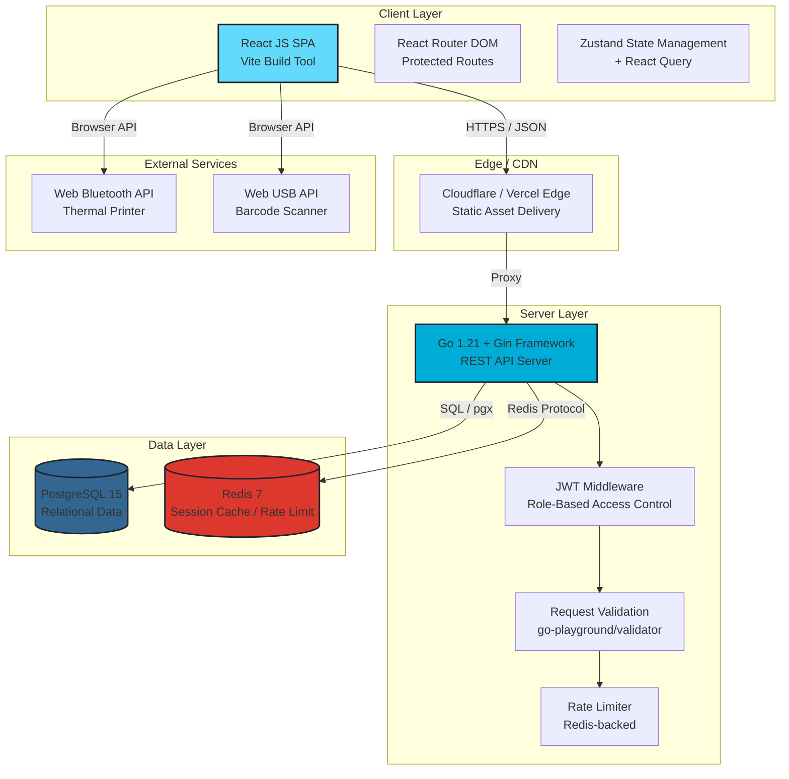
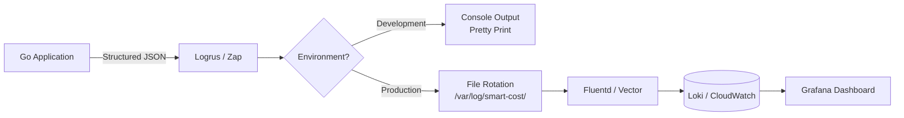

# Technical Specification Document (TECH_SPEC) - Smart Cost V1

**Versi:** 1.0  
**Status:** Draft Disetujui  
**Target Rilis:** MVP

---

## 1. System Architecture Diagram



### Architecture Rationale

- **SPA (Single Page Application):** Halaman kasir memerlukan interaktivitas tinggi (scan barcode, hold bill, perhitungan real-time). React SPA dengan Vite memberikan cold start < 1 detik dan HMR untuk development cepat.
- **Go + Gin:** Gin menawarkan routing performa tinggi dengan overhead minimal (~40x lebih cepat dari framework PHP tradisional). Goroutine-native concurrency menangani multiple kasir yang mengakses stok secara bersamaan tanpa blocking.
- **PostgreSQL:** ACID compliance dan row-level locking (`SELECT FOR UPDATE`) kritis untuk mencegah race condition saat pemotongan stok konkuren.
- **Redis:** Digunakan untuk session caching JWT blacklist dan rate limiting pada endpoint login.

---

## 2. Tech Stack Rationale

| Layer                  | Technology                 | Alternatives Considered         | Decision Rationale                                                                                                            |
| :--------------------- | :------------------------- | :------------------------------ | :---------------------------------------------------------------------------------------------------------------------------- |
| **Frontend Framework** | React 18 + Vite            | Vue 3, Svelte                   | Ekosistem terbesar untuk POS UI libraries; Vite memberikan build time 10x lebih cepat dari CRA.                               |
| **State Management**   | Zustand + React Query      | Redux Toolkit, MobX             | Zustand minimalis tanpa boilerplate; React Query menangani caching server state (stok, produk) secara otomatis.               |
| **UI Component**       | Tailwind CSS + Headless UI | Material UI, Chakra UI          | Tailwind memberikan kontrol penuh atas responsif mobile; Headless UI menyediakan accessible primitives tanpa styling lock-in. |
| **Backend Framework**  | Go 1.21 + Gin              | Node.js/Express, Python/FastAPI | Compile-time type safety, goroutine concurrency untuk stok locking, binary deployment tunggal tanpa runtime dependency.       |
| **Database**           | PostgreSQL 15              | MySQL 8, MongoDB                | Row-level locking (`FOR UPDATE`), JSONB untuk fleksibel price tiers, mature Go driver (`pgx`).                                |
| **Cache**              | Redis 7                    | Memcached, in-memory            | Pub/sub untuk real-time stock alerts, atomic counters untuk race-safe operations.                                             |
| **Authentication**     | JWT (RS256) + bcrypt       | Session Cookies + Redis         | Stateless auth memudahkan horizontal scaling; RS256 memungkinkan key rotation tanpa invalidate semua token.                   |
| **API Documentation**  | Swagger/OpenAPI 3.0        | Postman Collections             | OpenAPI spec dapat digenerate dari Go struct tags menggunakan `swaggo`; single source of truth untuk frontend contract.       |

---

## 3. Security & Authentication Strategy

### 3.1 Data Encryption

| State          | Method           | Implementation                                                                       |
| :------------- | :--------------- | :----------------------------------------------------------------------------------- |
| **In Transit** | TLS 1.3          | Enforced via Gin middleware; HSTS header dengan `max-age=31536000`                   |
| **At Rest**    | AES-256          | PostgreSQL native encryption (TDE) pada cloud provider                               |
| **Passwords**  | bcrypt (cost=12) | Hashing dilakukan sebelum INSERT ke tabel `users`; tidak pernah menyimpan plain text |

### 3.2 JWT Token Architecture

```
Header:    { "alg": "RS256", "typ": "JWT" }
Payload:   {
             "sub": "user_uuid",
             "role": "owner|cashier",
             "iat": 1718900000,
             "exp": 1718986400,
             "jti": "unique_token_id"
           }
Signature: RSASHA256(base64url(header) + "." + base64url(payload), private_key)
```

- **Access Token:** Expiry 24 jam, disimpan di `httpOnly` cookie (mitigasi XSS).
- **Refresh Token:** Expiry 7 hari, disimpan di cookie terpisah dengan `SameSite=Strict`.
- **Token Blacklist:** JWT ID (`jti`) yang logout dimasukkan ke Redis SET dengan TTL sama expiry token untuk revoke instan.

### 3.3 Route Protection Mechanics

```go
// Gin middleware hierarchy
func AuthMiddleware() gin.HandlerFunc {
    return func(c *gin.Context) {
        token, err := c.Cookie("access_token")
        if err != nil {
            c.AbortWithStatusJSON(401, ErrorResponse{Message: "Unauthorized"})
            return
        }
        claims, err := jwt.Validate(token, publicKey)
        if err != nil {
            c.AbortWithStatusJSON(401, ErrorResponse{Message: "Invalid token"})
            return
        }
        c.Set("user_id", claims.Sub)
        c.Set("role", claims.Role)
        c.Next()
    }
}

func RoleMiddleware(allowedRoles ...string) gin.HandlerFunc {
    return func(c *gin.Context) {
        userRole := c.GetString("role")
        for _, role := range allowedRoles {
            if userRole == role {
                c.Next()
                return
            }
        }
        c.AbortWithStatusJSON(403, ErrorResponse{Message: "Forbidden: insufficient privileges"})
    }
}
```

### 3.4 Role-Based Access Matrix

| Endpoint Pattern                       | Owner | Cashier |
| :------------------------------------- | :---- | :------ |
| `GET /api/v1/dashboard/*`              | ✅    | ❌      |
| `GET /api/v1/reports/*`                | ✅    | ❌      |
| `POST /api/v1/products`                | ✅    | ❌      |
| `PUT /api/v1/products/:id`             | ✅    | ❌      |
| `GET /api/v1/cashier`                  | ✅    | ✅      |
| `POST /api/v1/transactions`            | ❌    | ✅      |
| `POST /api/v1/transactions/:id/return` | ❌    | ✅      |
| `GET /api/v1/transactions/hold`        | ❌    | ✅      |

---

## 4. Global Error Handling & Logging Strategy

### 4.1 HTTP Response Status Code Map

| Status Code                 | Context                    | Frontend Action                                                        |
| :-------------------------- | :------------------------- | :--------------------------------------------------------------------- |
| `200 OK`                    | GET/PUT success            | Render data                                                            |
| `201 Created`               | POST success               | Redirect / Toast success                                               |
| `400 Bad Request`           | Validation error           | Display field errors                                                   |
| `401 Unauthorized`          | Missing/invalid JWT        | Redirect to `/login`                                                   |
| `403 Forbidden`             | Valid JWT but wrong role   | Show 403 page                                                          |
| `404 Not Found`             | Resource tidak ada         | Show 404 page                                                          |
| `409 Conflict`              | Race condition / duplicate | Show conflict message                                                  |
| `422 Unprocessable Entity`  | Business rule violation    | Show business error (e.g., stok tidak cukup - meskipun tidak diblokir) |
| `429 Too Many Requests`     | Rate limit exceeded        | Exponential backoff retry                                              |
| `500 Internal Server Error` | Server failure             | Log to Sentry, show generic error                                      |

### 4.2 Unified Error Response Schema

```json
{
  "code": 400,
  "message": "invalid request",
  "error": "email is required",
  "timestamp": "2024-06-20T10:30:00Z",
  "request_id": "req_abc123xyz"
}
```

### 4.3 Logging Pipeline



**Log Levels:**

- **ERROR:** 5xx responses, database connection failures, JWT validation errors
- **WARN:** 4xx responses, rate limit hits, stok minus transactions
- **INFO:** Successful transactions, user login/logout, hold bill creation
- **DEBUG:** Query execution time, cache hits/misses (development only)

**Sensitive Data Masking:** Passwords, JWT tokens, dan credit card numbers di-mask dengan pattern `[REDACTED]` sebelum ditulis ke log.
