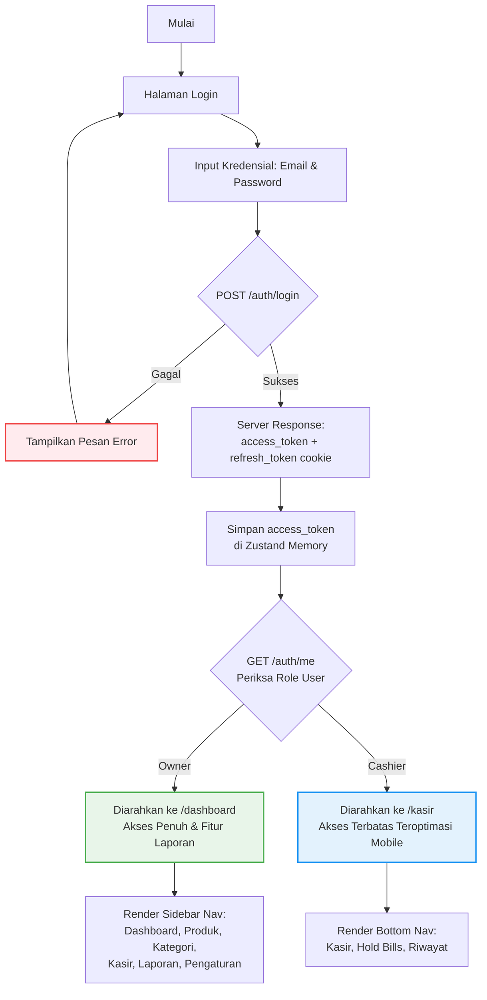
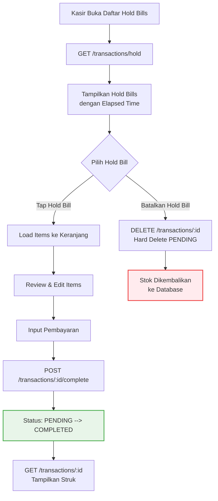

# User Flow & Wireframe Mapping - Smart Cost V1

**Versi:** 1.1
**Status:** Regenerated & Synced with PRD + SERVICES
**Target Rilis:** MVP (Minimum Viable Product)

---

## 1. Core User Journeys & Logic Gates (Mermaid Diagrams)

Aplikasi ini memiliki dua peran (_role_) dengan hak akses berbeda: **Pemilik (Owner)** dan **Kasir (Operator)**. Berikut adalah visualisasi alur perjalanan pengguna serta logika percabangannya.

### 1.1 Alur Otentikasi & Gerbang Masuk (Authentication Flow)

Alur ini memastikan pengguna diarahkan ke antarmuka yang tepat sesuai dengan hak akses mereka, serta memblokir akses ilegal jika sesi belum tervalidasi.



- **Logic Gates (Aturan Proteksi):**
  - Jika user mencoba mengakses `/dashboard` atau `/kasir` tanpa token sesi (JWT di header Authorization), sistem wajib melakukan _intercept_ dan melempar kembali ke halaman `/login`.
  - Jika user dengan role _Kasir_ mencoba mengetik URL `/dashboard` atau `/products` secara manual, sistem akan memblokir akses dan menampilkan halaman _403 Forbidden_.
  - Token refresh otomatis saat access token expired (401) via `POST /auth/refresh` dengan cookie refresh_token.

---

### 1.2 Alur Kerja Kasir: Transaksi & Pengkondisian Harga Grosir

Alur ini memetakan bagaimana Kasir memasukkan produk ke keranjang, bagaimana sistem menghitung skema grosir secara otomatis, hingga opsi pembayaran (_Direct Pay_ atau _Hold Bill_).

```mermaid
graph TD
    A[Kasir Buka Halaman /kasir] --> B[GET /products<br/>List produk aktif]
    B --> C[Tampilkan Grid Produk<br/>dengan Kategori Tabs]
    C --> D{Kasir Pilih Produk}

    D -- Tap Produk --> E[Tambah ke Keranjang]
    D -- Scan Barcode --> E

    E --> F{Kuantitas >=<br/>Batas Minimum Grosir?}

    F -- Ya --> G[Auto-update ke<br/>Harga Grosir]
    F -- Tidak --> H[Gunakan Harga Dasar]

    G --> I[Update Subtotal<br/>Keranjang Real-time]
    H --> I

    I --> J{Pilih Aksi}

    J -- Opsi A: Bayar Langsung --> K[Input Pembayaran:<br/>Cash/QRIS/Transfer]
    K --> L[POST /transactions<br/>type: "direct"]
    L --> M[Stok Dipotong +<br/>Generate TRX-XXXX]
    M --> N[Status: COMPLETED]
    N --> O[GET /transactions/:id<br/>Tampilkan Struk]
    O --> P[Opsi: Cetak Struk<br/>via Web Bluetooth API]

    J -- Opsi B: Hold Bill --> Q[Input Catatan:<br/>Nomor Meja/Nama]
    Q --> R[POST /transactions<br/>type: "hold"]
    R --> S[Stok Dipotong +<br/>Status: PENDING]
    S --> T[GET /transactions/hold<br/>Muncul di Daftar Antrean]
    T --> U[Keranjang Reset<br/>Siap Transaksi Baru]

    J -- Opsi C: Tambah Item --> D

    style N fill:#E8F5E9,stroke:#4CAF50,stroke-width:2px
    style S fill:#FFF3E0,stroke:#FF9800,stroke-width:2px
    style P fill:#E3F2FD,stroke:#2196F3,stroke-width:2px
```

**Key Business Rules:**

- Stok dipotong saat hold bill dibuat (bukan saat complete) untuk mencegah double sell.
- Harga grosir dihitung otomatis berdasarkan total qty per item dalam satu transaksi.
- `cashier_id` diambil dari JWT claims, bukan dari input user.

---

### 1.3 Alur Lanjutkan Hold Bill ke Pembayaran



**Key Business Rules:**

- Hanya kasir yang membuat hold bill atau owner yang bisa melanjutkan.
- Stok TIDAK dipotong lagi saat complete (sudah dipotong saat hold).
- Hold bill yang dibatalkan di-hard delete (bukan soft delete) karena belum ada pembayaran.

---

### 1.4 Alur Pembatalan / Pengembalian Barang (Return & Void)

Mencegah kerugian dan kecurangan kasir (_fraud_) dengan mencatat log audit lengkap, tanpa menghentikan operasional toko saat pemilik tidak ada di tempat.

```mermaid
graph TD
    A[Kasir Buka Riwayat Transaksi] --> B[GET /transactions<br/>Filter: COMPLETED]
    B --> C[Tampilkan List Transaksi<br/>Milik Kasir Sendiri]
    C --> D{Pilih Transaksi}

    D -- Tap Transaksi --> E[GET /transactions/:id<br/>Detail Transaksi]
    E --> F{Pilih Item untuk Return}

    F -- Tap Return --> G[Input Qty Return<br/>& Alasan]
    G --> H{Validasi: qty_returned <=<br/>qty_asli - qty_sudah_return?}

    H -- Tidak Valid --> I[Tampilkan Error:<br/>"Qty melebihi batas"]
    I --> G

    H -- Valid --> J[POST /transactions/:id/return]
    J --> K[Database Transaction:<br/>ACID Serializable]
    K --> L[Stok Produk +qty_returned]
    L --> M[INSERT void_logs<br/>dengan cashier_id returner]
    M --> N[UPDATE transactions<br/>total = total - refund]
    N --> O[Response: new_total +<br/>void_log_id]
    O --> P[Tampilkan Struk Updated]

    style K fill:#FFF3E0,stroke:#FF9800,stroke-width:2px
    style P fill:#E8F5E9,stroke:#4CAF50,stroke-width:2px
```

**Key Business Rules:**

- Return hanya untuk transaksi COMPLETED. Hold bill tidak bisa di-return.
- `cashier_id` di `void_logs` adalah kasir yang MELAKUKAN return, bukan pembuat transaksi.
- Refund menggunakan harga saat transaksi (`unit_price`), bukan harga sekarang.
- Stock reversal menggunakan `SELECT FOR UPDATE` untuk mencegah race condition.

---

### 1.5 Alur Pemilik: Pemantauan Dashboard & Notifikasi Stok Minus

Sistem memindai stok secara otomatis untuk memberikan peringatan dini kepada pemilik usaha.

```mermaid
graph TD
    A[Owner Login ke /dashboard] --> B[GET /auth/me<br/>Verifikasi Role: owner]
    B --> C[GET /reports/sales<br/>period: daily, 7 hari]
    C --> D[GET /reports/stock-alerts]
    D --> E{Ada Alert?}

    E -- Ya --> F[Tampilkan Badge Merah<br/>di Navbar: critical_count + low_count]
    F --> G[Tampilkan Section<br/>"Peringatan Stok" di Dashboard]
    G --> H{Owner Pilih Aksi}

    H -- Tap Alert --> I[Redirect ke /products/:id]
    I --> J[PUT /products/:id<br/>Update Stok]
    J --> K[Trigger: stock_status update<br/>+ Alert auto-resolve]

    H -- Lihat Laporan --> L[GET /reports/sales<br/>Filter: weekly/monthly]
    L --> M[Tampilkan Grafik &<br/>Cashier Performance]

    H -- Kelola Kasir --> N[GET /users<br/>List semua kasir]
    N --> O[POST /users<br/>Register kasir baru]

    E -- Tidak --> P[Tampilkan Dashboard Normal]
    P --> M

    style F fill:#FFEBEE,stroke:#EF4444,stroke-width:2px
    style K fill:#E8F5E9,stroke:#4CAF50,stroke-width:2px
    style M fill:#E3F2FD,stroke:#2196F3,stroke-width:2px
```

---

## 2. Interface Structures (ASCII Layouts)

Desain antarmuka dirancang responsif agar optimal saat diakses menggunakan tablet toko maupun smartphone kasir.

### 2.1 Tata Letak Halaman Kasir (Mobile-First / WA Style)

```
+------------------------------------------+
| [=] SMART COST            [User: Siti]   |
+------------------------------------------+
| [Q] Cari produk...                  [X]  |  <- Pill search (WA style)
+------------------------------------------+
| [Semua] [Makanan] [Minuman] [Snack] [>]  |  <- Horizontal scroll tabs
+------------------------------------------+
|                                          |
|  +------------------+  +----------------+|
|  | [Gambar Produk]  |  | [Gambar]       ||
|  |                  |  |                ||
|  +------------------+  +----------------+|
|  | Nasi Goreng      |  | Es Teh Manis   ||
|  | Rp30.000   [50]  |  | Rp4.000   [20] ||
|  +------------------+  +----------------+|
|                                          |
|  +------------------+  +----------------+|
|  | Teh Kotak        |  | Air Mineral    ||
|  | Rp3.000  [100]   |  | Rp3.500   [80] ||
|  | [Grosir 10pcs]   |  |                ||
|  +------------------+  +----------------+|
|                                          |
+------------------------------------------+
|        +------+                          |
|        |  5   |  <- FAB Cart (WA style) |
|        +------+                          |
+------------------------------------------+
```

**Bottom Sheet - Keranjang Belanja:**

```
+------------------------------------------+
|           [Drag Handle]                  |
| KERANJANG BELANJA              [Pesanan] |
+------------------------------------------+
| 1. Nasi Goreng Ayam              Rp60.000|
|    x2 @30.000                    [X]     |
| 2. Teh Kotak (Grosir)            Rp25.000|
|    x10 @2.500                    [X]     |
| 3. Es Teh Manis                   Rp8.000|
|    x2 @4.000                     [X]     |
+------------------------------------------+
| Subtotal                         Rp93.000|
|------------------------------------------|
| [SIMPAN HOLD]         [BAYAR Rp93.000]   |
+------------------------------------------+
```

### 2.2 Tata Letak Dashboard Pemilik (Mobile-First / Clean Style)

```
+------------------------------------------+
| [=] SMART COST              [(2) 🔔]     |  <- Alert badge
+------------------------------------------+
| Selamat datang,                          |
| Andi! 👋                                 |
+------------------------------------------+
| PENDAPATAN HARI INI                      |
| Rp 1.545.000                             |  <- Large price (Tokopedia style)
| ↑ 12% dari kemarin                       |
+------------------------------------------+
| [Grafik Mingguan - Bar Chart]            |
| Sen  Sel  Rab  Kam  Jum  Sab  Min        |
| ██   ███  ██   ████  ██   ███  █         |
+------------------------------------------+
| PERFORMA KASIR                           |
| +------------------+------------------+  |
| | Siti Aminah      | Budi Santoso     |  |
| | Rp 945.000       | Rp 600.000       |  |
| | 28 transaksi     | 19 transaksi     |  |
| +------------------+------------------+  |
+------------------------------------------+
| STOK ALERT (2)                           |
| ⚠️ Teh Kotak        Stok MINUS (-3)      |
| ⚡ Es Teh Manis      Stok Menipis (2)     |
|                                          |
+------------------------------------------+
| [Beranda] [Produk] [Laporan] [Akun]      |  <- Bottom nav (WA style)
+------------------------------------------+
```

### 2.3 Tata Letak Detail Produk (Owner)

```
+------------------------------------------+
| [<] Teh Kotak              [Edit] [Hapus]|
+------------------------------------------+
| [Gambar Produk]                          |
|                                          |
+------------------------------------------+
| Teh Kotak 250ml                          |
| SKU: TK-001 | Barcode: 8991234567890     |
|                                          |
| KATEGORI        HARGA DASAR     STOK      |
| Minuman         Rp 3.000        100 pcs   |
|                                          |
| BATAS MINIMAL     STATUS                |
| 10 pcs            SAFE 🟢               |
|                                          |
+------------------------------------------+
| HARGA GROSIR                             |
| +------------------+------------------+  |
| | >= 10 pcs        | Rp 2.500         |  |
| | Grosir 10pcs     |                  |  |
| +------------------+------------------+  |
| | >= 50 pcs        | Rp 2.200         |  |
| | Grosir 50pcs     |                  |  |
| +------------------+------------------+  |
+------------------------------------------+
| STATISTIK PENJUALAN                      |
| Terjual hari ini: 12 pcs                 |
| Terjual bulan ini: 340 pcs               |
+------------------------------------------+
```

### 2.4 Tata Letak Struk / Receipt (Cashier View)

```
+------------------------------------------+
|           SMART COST                     |
|       Struk Penjualan                    |
|------------------------------------------|
| No: TRX-200624-0001                      |
| Kasir: Siti Aminah                       |
| Waktu: 20 Jun 2024, 14:30 WIB           |
|------------------------------------------|
| 1. Nasi Goreng Ayam                      |
|    2 x Rp30.000              Rp 60.000   |
| 2. Teh Kotak (Grosir 10pcs)              |
|    10 x Rp2.500              Rp 25.000   |
| 3. Es Teh Manis                          |
|    2 x Rp4.000               Rp  8.000   |
|------------------------------------------|
| Subtotal                     Rp 93.000   |
| Total                        Rp 93.000   |
| Tunai                       Rp100.000   |
| Kembali                      Rp  7.000   |
|------------------------------------------|
| Terima kasih telah berbelanja!           |
|                                          |
| [Cetak Struk]      [Transaksi Baru]      |
+------------------------------------------+
```

---

## 3. Celah Logika yang Berhasil Diminimalkan (Loophole Prevention)

1. **Konkurensi Pengurangan Stok:** Stok langsung dikunci saat kasir menekan tombol _Hold Bill_. Ini mencegah kasir lain di perangkat berbeda menjual barang fisik yang sama yang saat itu sedang disajikan di meja pelanggan.
   - **Implementasi:** `SELECT stock FROM products WHERE id = ? FOR UPDATE` dalam transaction `REPEATABLE READ`.

2. **Validasi Stok Minus Kontrol:** Sistem mengizinkan stok menjadi minus di database agar transaksi tidak macet di depan pelanggan, namun _loophole_ kerugian bisnis ditutup dengan langsung memaksa sistem memunculkan peringatan berwarna merah di dashboard pemilik saat itu juga agar segera dilakukan opname fisik.
   - **Implementasi:** Database trigger auto-insert ke `stock_alerts` dengan `alert_type = 'MINUS'`.

3. **Jejak Digital Pembatalan:** Tombol _Return_ tidak memerlukan otorisasi PIN fisik pemilik di tempat (karena pemilik sering berada di luar toko), namun celah kecurangan kasir ditutup dengan sistem pencatatan log audit otomatis (`void_logs`) yang mengikat tindakan tersebut pada User ID kasir yang aktif, sehingga pemilik bisa memeriksa kejanggalan kapan saja dari HP mereka.
   - **Implementasi:** `cashier_id` di `void_logs` = kasir yang melakukan return (dari JWT), bukan pembuat transaksi.

4. **Manipulasi Harga:** Frontend mengirim `price_at_time` tapi backend melakukan re-kalkulasi. Jika mismatch, transaksi ditolak.
   - **Implementasi:** Backend resolve price tier berdasarkan `base_price` + `price_tiers` di DB, bandingkan dengan `price_at_time` dari request.

5. **Session Hijacking:** Access token di memory (bukan localStorage), refresh token di httpOnly cookie. Token yang logout di-blacklist di Redis.
   - **Implementasi:** JWT `jti` dimasukkan ke Redis SET dengan TTL = sisa expiry.

---

**Dokumen ini merupakan pemetaan user flow lengkap untuk Smart Cost V1.**
**Versi:** 1.1
**Terakhir Diperbarui:** Juli 2026
