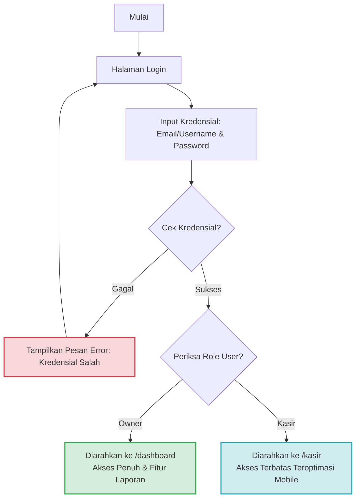
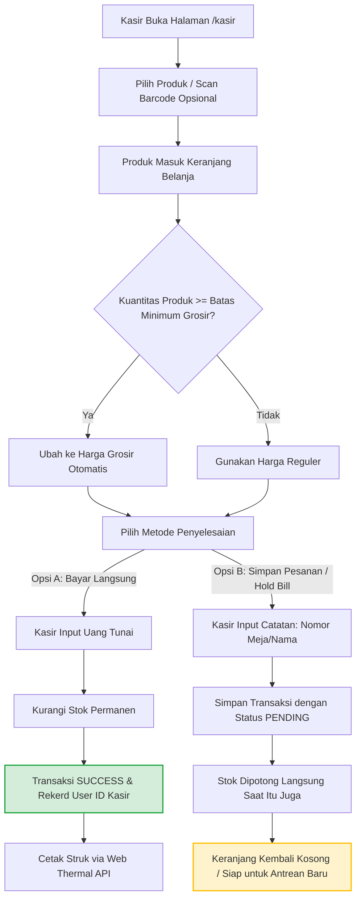
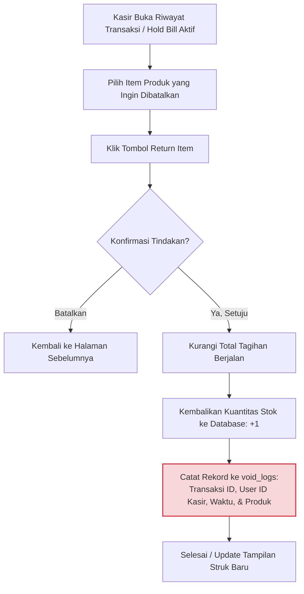
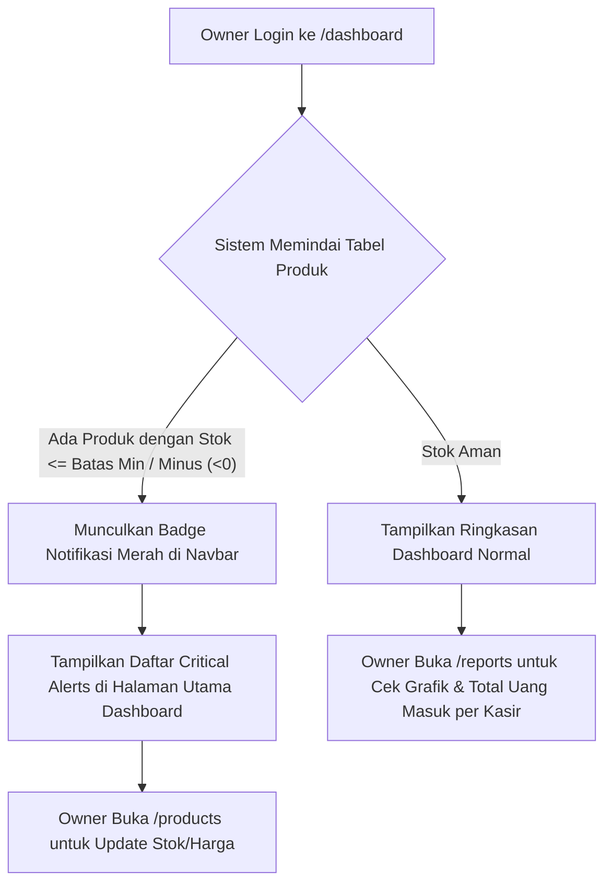

# User Flow & Wireframe Mapping - Smart Cost V1

**Versi:** 1.0
**Status:** Draft Disetujui  
**Target Rilis:** MVP (Minimum Viable Product)

---

## 1. Core User Journeys & Logic Gates (Mermaid Diagrams)

Aplikasi ini memiliki dua peran (_role_) dengan hak akses berbeda: **Pemilik (Owner)** dan **Kasir (Operator)**. Berikut adalah visualisasi alur perjalanan pengguna serta logika percabangannya.

### 1.1 Alur Otentikasi & Gerbang Masuk (Authentication Flow)

Alur ini memastikan pengguna diarahkan ke antarmuka yang tepat sesuai dengan hak akses mereka, serta memblokir akses ilegal jika sesi belum tervalidasi.



- **Logic Gates (Aturan Proteksi):**
  - Jika user mencoba mengakses `/dashboard` atau `/kasir` tanpa token sesi (JWT/Session Cookie), sistem wajib melakukan _intercept_ dan melempar kembali ke halaman `/login`.
  - Jika user dengan role _Kasir_ mencoba mengetik URL `/dashboard` atau `/products` secara manual, sistem akan memblokir akses dan menampilkan halaman _403 Forbidden_.

---

### 1.2 Alur Kerja Kasir: Transaksi & Pengkondisian Harga Grosir

Alur ini memetakan bagaimana Kasir memasukkan produk ke keranjang, bagaimana sistem menghitung skema grosir secara otomatis, hingga opsi pembayaran (_Direct Pay_ atau _Hold Bill_).



---

### 1.3 Alur Pembatalan / Pengembalian Barang (Return & Void)

Mencegah kerugian dan kecurangan kasir (_fraud_) dengan mencatat log audit lengkap, tanpa menghentikan operasional toko saat pemilik tidak ada di tempat.



---

### 1.4 Alur Pemilik: Pemantauan Dashboard & Notifikasi Stok Minus

Sistem memindai stok secara otomatis untuk memberikan peringatan dini kepada pemilik usaha.



---

## 2. Interface Structures (ASCII Layouts)

Desain antarmuka dirancang responsif agar optimal saat diakses menggunakan tablet toko maupun smartphone kasir.

### 2.1 Tata Letak Halaman Kasir (Responsif / Tablet & Desktop View)

```
+-----------------------------------------------------------------------------+
|  [SMART COST]                                         (User: Siti - KASIR)  |
+------------------------------------+----------------------------------------+
| CARI PRODUK: [ Cari nama/barcode ] | KERANJANG BELANJA      [Pesanan Baru]  |
+------------------------------------+----------------------------------------+
| [ KATEGORI: MAKANAN | MINUMAN ]    | 1. Nasi Goreng Ayam      (x2)  60.000  |
|                                    | 2. Es Teh Manis          (x2)   8.000  |
| +----------------+ +-------------+ | 3. Teh Kotak (Grosir)*  (x10)  25.000  |
| | Nasi Goreng Ap | | Mie Goreng  | |                                        |
| | Rp30.000       | | Rp25.000    | | *Grosir Aktif (Min. 10 pcs)            |
| +----------------+ +-------------+ |                                        |
| +----------------+ +-------------+ |----------------------------------------|
| | Es Teh Manis   | | Teh Kotak  | | TOTAL BELANJA:               Rp93.000  |
| | Rp4.000        | | Rp3.000    | |----------------------------------------|
| +----------------+ +-------------+ | [ TAHAN / HOLD BILL ]  [ BAYAR TUNAI ] |
+------------------------------------+----------------------------------------+
| [Daftar Antrean Hold (3)]          | [Riwayat Transaksi Shift Ini]          |
+------------------------------------+----------------------------------------+
```

### 2.2 Tata Letak Dashboard Pemilik (Owner View - Mobile-Optimized)

```
+---------------------------------------+
| [=] SMART COST              [ (1) 🔔 ]| <-- Notifikasi Stok Menipis/Minus
+---------------------------------------+
| SELAMAT DATANG, ANDI (OWNER)          |
|                                       |
| PENDAPATAN HARI INI:                  |
| Rp 1.545.000                          |
|                                       |
| [ Grafik Pendapatan Bulanan (Canvas) ]|
|  Jan  [██████]                        |
|  Feb  [███████████]                   |
|                                       |
|---------------------------------------|
| PERFORMA KASIR (TOTAL UANG MASUK):    |
| - Siti (Shift Pagi) : Rp  945.000     |
| - Budi (Shift Malam): Rp  600.000     |
|                                       |
|---------------------------------------|
| PENGINGAT STOK (CRITICAL ALERTS):     |
| ⚠️ Es Teh Manis  : Stok MINUS (-3)    |
| ⚠️ Teh Kotak     : Stok Menipis (2)   |
+---------------------------------------+
| [ Dashboard ] [ Produk ] [ Laporan ]  | <-- Bottom Navigation di HP
+---------------------------------------+
```

---

## 3. Celah Logika yang Berhasil Diminimalkan (Loophole Prevention)

1. **Konkurensi Pengurangan Stok:** Stok langsung dikunci saat kasir menekan tombol _Hold Bill_. Ini mencegah kasir lain di perangkat berbeda menjual barang fisik yang sama yang saat itu sedang disajikan di meja pelanggan.
2. **Validasi Stok Minus Kontrol:** Sistem mengizinkan stok menjadi minus di database agar transaksi tidak macet di depan pelanggan, namun _loophole_ kerugian bisnis ditutup dengan langsung memaksa sistem memunculkan peringatan berwarna merah di dashboard pemilik saat itu juga agar segera dilakukan opname fisik.
3. **Jejak Digital Pembatalan:** Tombol _Return_ tidak memerlukan otorisasi PIN fisik pemilik di tempat (karena pemilik sering berada di luar toko), namun celah kecurangan kasir ditutup dengan sistem pencatatan log audit otomatis (`void_logs`) yang mengikat tindakan tersebut pada User ID kasir yang aktif, sehingga pemilik bisa memeriksa kejanggalan kapan saja dari HP mereka.
